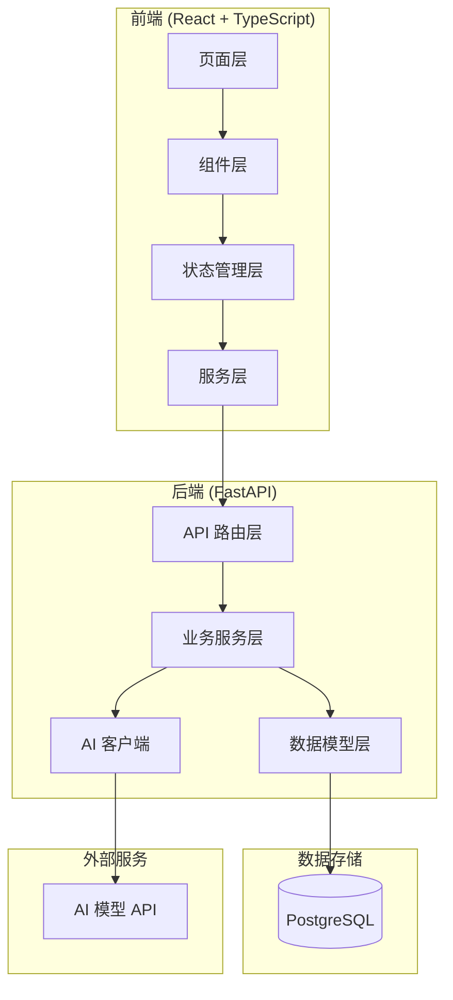
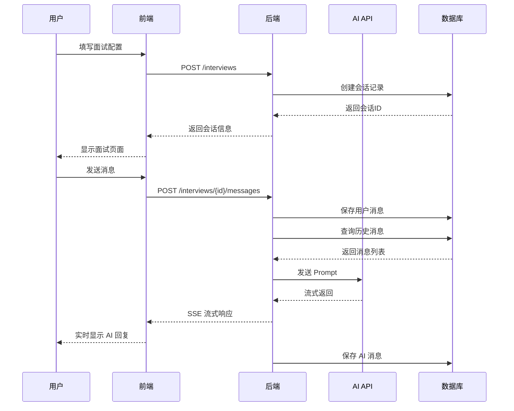
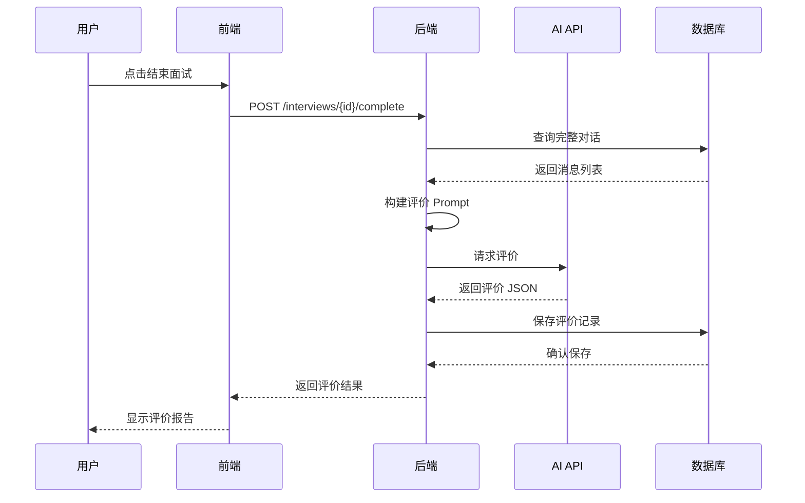
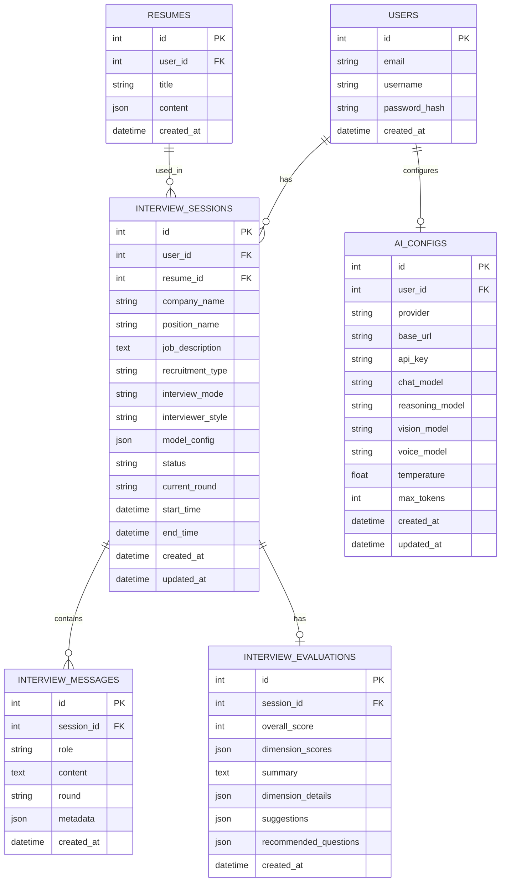

# AI 面试官功能 - 系统设计文档

## 文档信息
- **创建日期**: 2026-02-12
- **功能名称**: AI 面试官 (AI Interviewer)
- **文档类型**: DESIGN - 系统架构与详细设计

---

## 1. 系统架构图



---

## 2. 模块设计

### 2.1 前端模块

#### 2.1.1 页面结构

```
src/pages/Interview/
├── InterviewConfig/           # 面试配置页
│   ├── index.tsx
│   ├── CompanyForm.tsx        # 企业信息表单
│   ├── ModeSelector.tsx       # 模式选择器
│   └── StyleSelector.tsx      # 风格选择器
├── InterviewSession/          # 面试进行页
│   ├── index.tsx
│   ├── ChatInterface.tsx      # 聊天界面
│   ├── MessageBubble.tsx      # 消息气泡
│   ├── RoundIndicator.tsx     # 轮次指示器
│   └── ModelSwitcher.tsx      # 模型切换器
├── InterviewReport/           # 评价报告页
│   ├── index.tsx
│   ├── ScoreRadar.tsx         # 雷达图
│   ├── DimensionCard.tsx      # 维度卡片
│   └── SuggestionList.tsx     # 建议列表
└── InterviewHistory/          # 历史记录页
    ├── index.tsx
    └── InterviewCard.tsx      # 面试卡片
```

#### 2.1.2 组件设计

**ChatInterface 组件**
```typescript
interface ChatInterfaceProps {
  sessionId: number;
  messages: InterviewMessage[];
  currentRound: InterviewRound;
  onSendMessage: (content: string) => Promise<void>;
  onComplete: () => void;
  onAbort: () => void;
}
```

**MessageBubble 组件**
```typescript
interface MessageBubbleProps {
  message: InterviewMessage;
  isStreaming?: boolean;
}
```

**ScoreRadar 组件**
```typescript
interface ScoreRadarProps {
  scores: DimensionScores;
  size?: number;
}
```

#### 2.1.3 状态管理

**interviewStore.ts**
```typescript
interface InterviewState {
  // 当前会话
  currentSession: InterviewSession | null;
  messages: InterviewMessage[];
  isLoading: boolean;
  error: string | null;
  
  // 配置
  config: InterviewConfig;
  
  // Actions
  createSession: (config: InterviewConfig) => Promise<void>;
  sendMessage: (content: string) => Promise<void>;
  completeInterview: () => Promise<void>;
  abortInterview: () => Promise<void>;
  loadSession: (id: number) => Promise<void>;
  loadHistory: (page: number) => Promise<void>;
}
```

**aiConfigStore.ts**
```typescript
interface AIConfigState {
  config: AIConfig | null;
  availableModels: string[];
  isTesting: boolean;
  
  // Actions
  loadConfig: () => Promise<void>;
  saveConfig: (config: AIConfig) => Promise<void>;
  testConnection: (url: string, key: string) => Promise<string[]>;
  fetchModels: () => Promise<string[]>;
}
```

### 2.2 后端模块

#### 2.2.1 模块结构

```
backend/app/
├── api/v1/
│   ├── interview.py           # 面试会话路由
│   ├── ai_service.py          # AI 服务路由
│   └── ai_config.py           # AI 配置路由
├── services/
│   ├── interview_service.py   # 面试业务逻辑
│   ├── ai_service.py          # AI 调用服务
│   └── ai_config_service.py   # 配置管理服务
├── models/
│   └── interview.py           # 面试相关模型
├── schemas/
│   └── interview.py           # Pydantic 模型
└── core/
    └── ai_client.py           # AI 客户端封装
```

#### 2.2.2 服务层设计

**InterviewService**
```python
class InterviewService:
    async def create_session(
        self,
        user_id: int,
        config: InterviewCreate
    ) -> InterviewSession:
        """创建面试会话"""
        
    async def process_message(
        self,
        session_id: int,
        content: str
    ) -> AsyncGenerator[str, None]:
        """处理用户消息，返回 AI 流式响应"""
        
    async def generate_evaluation(
        self,
        session_id: int
    ) -> InterviewEvaluation:
        """生成面试评价"""
        
    async def complete_session(
        self,
        session_id: int
    ) -> InterviewSession:
        """完成面试会话"""
```

**AIService**
```python
class AIService:
    def __init__(self, config: AIConfig):
        self.client = AsyncOpenAI(
            base_url=config.base_url,
            api_key=config.api_key
        )
        
    async def chat_stream(
        self,
        messages: list[dict],
        model: str,
        temperature: float = 0.7
    ) -> AsyncGenerator[str, None]:
        """流式对话"""
        
    async def chat_complete(
        self,
        messages: list[dict],
        model: str,
        temperature: float = 0.7
    ) -> str:
        """非流式对话"""
        
    async def list_models(self) -> list[str]:
        """获取可用模型列表"""
```

**PromptService**
```python
class PromptService:
    def build_system_prompt(
        self,
        session: InterviewSession,
        resume: Resume
    ) -> str:
        """构建系统 Prompt"""
        
    def build_evaluation_prompt(
        self,
        session: InterviewSession,
        messages: list[InterviewMessage]
    ) -> str:
        """构建评价 Prompt"""
        
    def get_style_prompt(self, style: str) -> str:
        """获取风格 Prompt"""
        
    def get_mode_instructions(self, mode: str) -> str:
        """获取模式指令"""
```

#### 2.2.3 路由层设计

**interview.py**
```python
@router.post("", response_model=InterviewSessionResponse)
async def create_interview(
    data: InterviewCreate,
    current_user: User = Depends(get_current_user),
    db: AsyncSession = Depends(get_db)
):
    """创建面试会话"""

@router.get("/{id}", response_model=InterviewSessionDetail)
async def get_interview(
    id: int,
    current_user: User = Depends(get_current_user),
    db: AsyncSession = Depends(get_db)
):
    """获取面试会话详情"""

@router.post("/{id}/messages")
async def send_message(
    id: int,
    data: MessageCreate,
    current_user: User = Depends(get_current_user),
    db: AsyncSession = Depends(get_db)
):
    """发送消息（SSE 流式响应）"""

@router.post("/{id}/complete")
async def complete_interview(
    id: int,
    current_user: User = Depends(get_current_user),
    db: AsyncSession = Depends(get_db)
):
    """完成面试"""

@router.get("/{id}/evaluation", response_model=EvaluationResponse)
async def get_evaluation(
    id: int,
    current_user: User = Depends(get_current_user),
    db: AsyncSession = Depends(get_db)
):
    """获取评价报告"""
```

---

## 3. 数据流设计

### 3.1 面试流程数据流



### 3.2 评价生成数据流



---

## 4. 接口规范

### 4.1 请求/响应格式

#### 创建面试会话
```http
POST /api/v1/interviews
Content-Type: application/json

{
  "resume_id": 1,
  "company_name": "字节跳动",
  "position_name": "前端工程师",
  "job_description": "负责抖音前端开发...",
  "recruitment_type": "campus",
  "interview_mode": "project_deep_dive",
  "interviewer_style": "strict",
  "model_config": {
    "chat_model": "qwen3-max"
  }
}

Response: 201 Created
{
  "id": 123,
  "user_id": 1,
  "resume_id": 1,
  "company_name": "字节跳动",
  "position_name": "前端工程师",
  "job_description": "负责抖音前端开发...",
  "recruitment_type": "campus",
  "interview_mode": "project_deep_dive",
  "interviewer_style": "strict",
  "model_config": {
    "chat_model": "qwen3-max"
  },
  "status": "ongoing",
  "current_round": "opening",
  "start_time": "2026-02-12T14:30:00Z",
  "created_at": "2026-02-12T14:30:00Z"
}
```

#### 发送消息（SSE）
```http
POST /api/v1/interviews/123/messages
Content-Type: application/json

{
  "content": "您好，我是候选人张三..."
}

Response: text/event-stream

event: message
data: {"content": "你好", "role": "ai"}

event: message
data: {"content": "，", "role": "ai"}

event: message
data: {"content": "我是今天的面试官", "role": "ai"}

event: complete
data: {"message_id": 456}
```

#### 获取评价报告
```http
GET /api/v1/interviews/123/evaluation

Response: 200 OK
{
  "id": 789,
  "session_id": 123,
  "overall_score": 85,
  "dimension_scores": {
    "communication": 88,
    "technical_depth": 82,
    "project_experience": 85,
    "adaptability": 83,
    "job_match": 87
  },
  "summary": "候选人整体表现良好，技术基础扎实...",
  "dimension_details": {
    "communication": "表达清晰，逻辑性强...",
    "technical_depth": "对前端框架原理理解深入...",
    "project_experience": "项目经验丰富...",
    "adaptability": "面对追问能够灵活应对...",
    "job_match": "与前端工程师岗位匹配度高..."
  },
  "suggestions": [
    "建议深入学习性能优化相关知识",
    "可以多关注前端工程化实践"
  ],
  "recommended_questions": [
    "React 虚拟 DOM 的工作原理是什么？",
    "如何优化首屏加载时间？"
  ],
  "created_at": "2026-02-12T15:00:00Z"
}
```

### 4.2 错误处理

```http
// 会话不存在
HTTP/1.1 404 Not Found
{
  "detail": "Interview session not found"
}

// 无权限访问
HTTP/1.1 403 Forbidden
{
  "detail": "You don't have permission to access this interview"
}

// AI 服务错误
HTTP/1.1 503 Service Unavailable
{
  "detail": "AI service temporarily unavailable",
  "retry_after": 30
}

// 验证错误
HTTP/1.1 422 Unprocessable Entity
{
  "detail": [
    {
      "loc": ["body", "company_name"],
      "msg": "Company name is required",
      "type": "value_error.missing"
    }
  ]
}
```

---

## 5. 数据库设计

### 5.1 ER 图



### 5.2 索引设计

```sql
-- 面试会话表索引
CREATE INDEX idx_interview_sessions_user_id ON interview_sessions(user_id);
CREATE INDEX idx_interview_sessions_status ON interview_sessions(status);
CREATE INDEX idx_interview_sessions_created_at ON interview_sessions(created_at DESC);

-- 面试消息表索引
CREATE INDEX idx_interview_messages_session_id ON interview_messages(session_id);
CREATE INDEX idx_interview_messages_round ON interview_messages(round);

-- AI 配置表索引
CREATE UNIQUE INDEX idx_ai_configs_user_id ON ai_configs(user_id);
```

---

## 6. 异常处理策略

### 6.1 异常分类

| 异常类型 | 场景 | 处理策略 |
|---------|------|---------|
| 业务异常 | 会话不存在、无权限 | 返回 404/403，前端提示 |
| AI 服务异常 | API 超时、模型错误 | 重试 3 次，失败返回友好提示 |
| 网络异常 | 连接中断 | SSE 自动重连，消息不丢失 |
| 数据异常 | 数据库错误 | 事务回滚，记录日志 |

### 6.2 重试机制

```python
from tenacity import retry, stop_after_attempt, wait_exponential

@retry(
    stop=stop_after_attempt(3),
    wait=wait_exponential(multiplier=1, min=2, max=10),
    retry=retry_if_exception_type(AIServiceError)
)
async def call_ai_api(messages: list[dict]) -> str:
    """调用 AI API，带重试机制"""
    ...
```

### 6.3 降级策略

- AI 服务不可用时，提示用户稍后重试
- 评价生成失败时，允许用户手动重新生成
- 流式响应中断时，支持断点续传

---

## 7. 安全设计

### 7.1 数据安全

- API Key 使用 AES-256 加密存储
- 面试数据仅用户本人可访问
- 敏感信息（如 API Key）不在日志中记录

### 7.2 访问控制

```python
async def get_interview_session(
    session_id: int,
    user_id: int,
    db: AsyncSession
) -> InterviewSession:
    session = await db.get(InterviewSession, session_id)
    if not session:
        raise HTTPException(404, "Session not found")
    if session.user_id != user_id:
        raise HTTPException(403, "Permission denied")
    return session
```

### 7.3 限流策略

- 单个用户并发面试数限制：3 个
- AI API 调用频率限制：60 次/分钟
- 评价生成限制：10 次/小时

---

## 8. 性能优化

### 8.1 数据库优化

- 使用连接池（asyncpg）
- 关键查询添加索引
- 消息列表分页加载

### 8.2 AI 调用优化

- 使用流式响应减少等待时间
- 实现对话摘要，控制上下文长度
- 缓存系统 Prompt

### 8.3 前端优化

- 消息列表虚拟滚动
- AI 回复逐字动画
- 图片懒加载

---

## 9. 相关文档

- [ALIGNMENT_ai-interviewer.md](./ALIGNMENT_ai-interviewer.md) - 需求对齐文档
- [CONSENSUS_ai-interviewer.md](./CONSENSUS_ai-interviewer.md) - 需求共识文档
- [TASK_ai-interviewer.md](./TASK_ai-interviewer.md) - 任务拆分文档

---

## 10. 变更记录

| 日期 | 版本 | 变更内容 | 作者 |
|-----|------|---------|------|
| 2026-02-12 | v1.0 | 初始版本 | AI Assistant |
