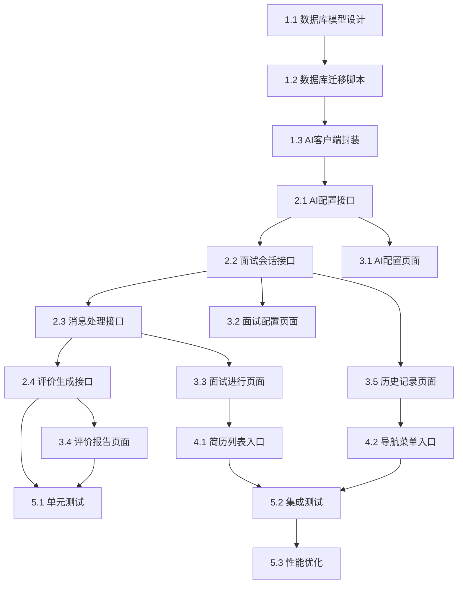
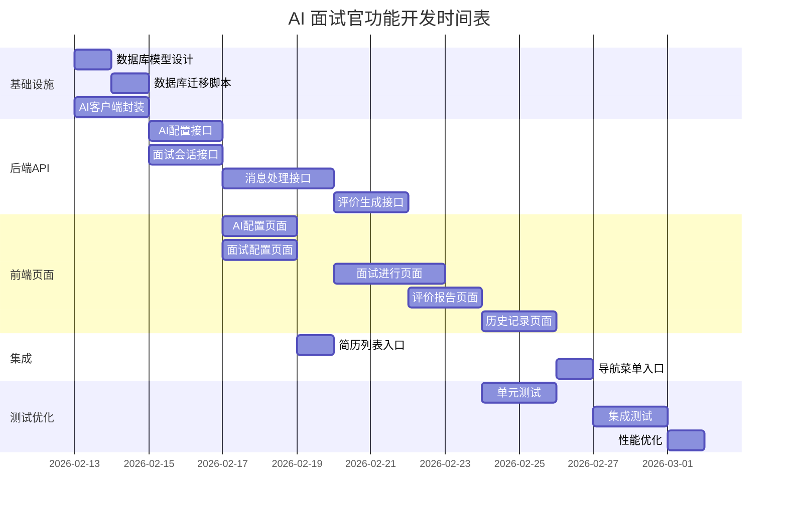

# AI 面试官功能 - 任务拆分文档

## 文档信息
- **创建日期**: 2026-02-12
- **功能名称**: AI 面试官 (AI Interviewer)
- **文档类型**: TASK - 原子化任务拆分

---

## 1. 任务依赖图

---

## 2. 原子任务列表

### 阶段1: 基础设施 (Foundation)

#### 任务 1.1: 数据库模型设计
- **任务ID**: T1.1
- **优先级**: P0
- **预估工时**: 4h
- **输入契约**:
  - 需求文档中的数据模型定义
  - 现有数据库模型参考
- **输出契约**:
  - `backend/app/models/interview.py` 文件
  - 包含 InterviewSession, InterviewMessage, InterviewEvaluation, AIConfig 模型
- **验收标准**:
  - [ ] 所有模型类正确定义
  - [ ] 外键关系正确建立
  - [ ] 与现有 User, Resume 模型关联正确
- **依赖**: 无

#### 任务 1.2: 数据库迁移脚本
- **任务ID**: T1.2
- **优先级**: P0
- **预估工时**: 2h
- **输入契约**:
  - T1.1 完成的模型定义
- **输出契约**:
  - `backend/alembic/versions/xxx_add_interview_tables.py` 迁移文件
- **验收标准**:
  - [ ] 迁移脚本可正常执行
  - [ ] 数据库表结构正确创建
  - [ ] 索引正确创建
- **依赖**: T1.1

#### 任务 1.3: AI 客户端封装
- **任务ID**: T1.3
- **优先级**: P0
- **预估工时**: 6h
- **输入契约**:
  - OpenAI 兼容接口规范
- **输出契约**:
  - `backend/app/core/ai_client.py` 文件
  - 支持流式和非流式调用
  - 支持模型列表获取
- **验收标准**:
  - [ ] 封装类支持自定义 base_url 和 api_key
  - [ ] 流式响应使用 AsyncGenerator
  - [ ] 支持重试机制
  - [ ] 错误处理完善
- **依赖**: 无

---

### 阶段2: 后端 API (Backend API)

#### 任务 2.1: AI 配置接口
- **任务ID**: T2.1
- **优先级**: P0
- **预估工时**: 6h
- **输入契约**:
  - T1.3 AI 客户端
  - AI 配置数据模型
- **输出契约**:
  - `backend/app/api/v1/ai_config.py` 路由文件
  - `backend/app/services/ai_config_service.py` 服务文件
  - `backend/app/schemas/ai_config.py` 模型文件
- **接口列表**:
  - GET /api/v1/ai-config - 获取配置
  - PUT /api/v1/ai-config - 更新配置
  - POST /api/v1/ai-config/test - 测试连接
- **验收标准**:
  - [ ] 所有接口正常工作
  - [ ] API Key 加密存储
  - [ ] 模型列表自动获取
  - [ ] 连接测试功能正常
- **依赖**: T1.2, T1.3

#### 任务 2.2: 面试会话接口
- **任务ID**: T2.2
- **优先级**: P0
- **预估工时**: 8h
- **输入契约**:
  - T1.2 数据库模型
  - 面试会话业务逻辑
- **输出契约**:
  - `backend/app/api/v1/interview.py` 路由文件（部分）
  - `backend/app/services/interview_service.py` 服务文件（部分）
  - `backend/app/schemas/interview.py` 模型文件
- **接口列表**:
  - POST /api/v1/interviews - 创建会话
  - GET /api/v1/interviews - 列表查询
  - GET /api/v1/interviews/{id} - 详情查询
  - POST /api/v1/interviews/{id}/complete - 完成面试
  - POST /api/v1/interviews/{id}/abort - 放弃面试
- **验收标准**:
  - [ ] 会话创建正确
  - [ ] 权限控制正确
  - [ ] 状态流转正确
- **依赖**: T1.2

#### 任务 2.3: 消息处理接口
- **任务ID**: T2.3
- **优先级**: P0
- **预估工时**: 10h
- **输入契约**:
  - T2.2 面试会话接口
  - T1.3 AI 客户端
- **输出契约**:
  - `backend/app/api/v1/interview.py` 路由文件（消息部分）
  - `backend/app/services/interview_service.py` 服务文件（消息处理）
  - `backend/app/services/prompt_service.py` Prompt 服务
- **接口列表**:
  - POST /api/v1/interviews/{id}/messages - 发送消息（SSE）
  - GET /api/v1/interviews/{id}/messages - 消息列表
- **验收标准**:
  - [ ] SSE 流式响应正常
  - [ ] Prompt 构建正确
  - [ ] 轮次切换逻辑正确
  - [ ] 消息保存正确
- **依赖**: T2.2, T1.3

#### 任务 2.4: 评价生成接口
- **任务ID**: T2.4
- **优先级**: P0
- **预估工时**: 6h
- **输入契约**:
  - T2.3 消息处理
  - 评价 Prompt 模板
- **输出契约**:
  - `backend/app/services/interview_service.py` 评价生成方法
  - 评价生成 Prompt 模板
- **接口列表**:
  - GET /api/v1/interviews/{id}/evaluation - 获取评价
  - POST /api/v1/interviews/{id}/evaluation/regenerate - 重新生成
- **验收标准**:
  - [ ] 评价 JSON 解析正确
  - [ ] 评分维度完整
  - [ ] 建议内容合理
- **依赖**: T2.3

---

### 阶段3: 前端页面 (Frontend Pages)

#### 任务 3.1: AI 配置页面
- **任务ID**: T3.1
- **优先级**: P1
- **预估工时**: 6h
- **输入契约**:
  - T2.1 AI 配置接口
  - 现有表单组件
- **输出契约**:
  - `frontend/src/pages/Interview/AIConfig/` 目录
  - AI 配置表单组件
  - 模型选择组件
- **验收标准**:
  - [ ] 配置表单完整
  - [ ] 连接测试功能
  - [ ] 模型列表自动获取
  - [ ] 配置保存成功
- **依赖**: T2.1

#### 任务 3.2: 面试配置页面
- **任务ID**: T3.2
- **优先级**: P0
- **预估工时**: 8h
- **输入契约**:
  - T2.2 面试会话接口
  - 简历列表数据
- **输出契约**:
  - `frontend/src/pages/Interview/InterviewConfig/` 目录
  - 企业信息表单
  - 模式选择器
  - 风格选择器
- **验收标准**:
  - [ ] 简历选择功能
  - [ ] 表单验证完整
  - [ ] 模式动态切换
  - [ ] 创建会话成功跳转
- **依赖**: T2.2

#### 任务 3.3: 面试进行页面
- **任务ID**: T3.3
- **优先级**: P0
- **预估工时**: 12h
- **输入契约**:
  - T2.3 消息处理接口
  - T3.2 面试配置
- **输出契约**:
  - `frontend/src/pages/Interview/InterviewSession/` 目录
  - 聊天界面组件
  - 消息气泡组件
  - 轮次指示器
  - 模型切换器
- **验收标准**:
  - [ ] SSE 流式接收正常
  - [ ] 消息实时显示
  - [ ] 输入框支持多行
  - [ ] 结束/放弃按钮功能
  - [ ] 模型切换功能
- **依赖**: T2.3, T3.2

#### 任务 3.4: 评价报告页面
- **任务ID**: T3.4
- **优先级**: P0
- **预估工时**: 8h
- **输入契约**:
  - T2.4 评价接口
  - T3.3 面试进行页面
- **输出契约**:
  - `frontend/src/pages/Interview/InterviewReport/` 目录
  - 雷达图组件
  - 维度卡片组件
  - 建议列表组件
- **验收标准**:
  - [ ] 雷达图正确显示
  - [ ] 各维度评分展示
  - [ ] 改进建议列表
  - [ ] 推荐题目列表
- **依赖**: T2.4, T3.3

#### 任务 3.5: 历史记录页面
- **任务ID**: T3.5
- **优先级**: P1
- **预估工时**: 6h
- **输入契约**:
  - T2.2 面试列表接口
  - T3.4 评价报告页面
- **输出契约**:
  - `frontend/src/pages/Interview/InterviewHistory/` 目录
  - 面试列表组件
  - 面试卡片组件
- **验收标准**:
  - [ ] 列表分页加载
  - [ ] 卡片信息完整
  - [ ] 点击进入详情
  - [ ] 删除功能
- **依赖**: T2.2, T3.4

---

### 阶段4: 集成与入口 (Integration)

#### 任务 4.1: 简历列表入口
- **任务ID**: T4.1
- **优先级**: P0
- **预估工时**: 2h
- **输入契约**:
  - T3.2 面试配置页面
  - 现有简历列表页面
- **输出契约**:
  - ResumeCard 组件添加"模拟面试"按钮
  - 点击跳转面试配置页并预填简历
- **验收标准**:
  - [ ] 按钮显示正常
  - [ ] 点击跳转正确
  - [ ] 简历信息预填
- **依赖**: T3.2

#### 任务 4.2: 导航菜单入口
- **任务ID**: T4.2
- **优先级**: P0
- **预估工时**: 2h
- **输入契约**:
  - T3.5 历史记录页面
  - T3.2 面试配置页面
  - 现有导航组件
- **输出契约**:
  - Header 组件添加"AI面试"菜单
  - 下拉菜单：开始面试、历史记录
- **验收标准**:
  - [ ] 菜单显示正常
  - [ ] 下拉功能正常
  - [ ] 跳转正确
- **依赖**: T3.5, T3.2

---

### 阶段5: 测试与优化 (Testing & Optimization)

#### 任务 5.1: 单元测试
- **任务ID**: T5.1
- **优先级**: P1
- **预估工时**: 8h
- **输入契约**:
  - T2.4 后端接口
  - T3.4 前端页面
- **输出契约**:
  - 后端服务单元测试
  - 前端组件单元测试
- **测试范围**:
  - [ ] InterviewService 测试
  - [ ] AIService 测试
  - [ ] PromptService 测试
  - [ ] 关键组件测试
- **依赖**: T2.4, T3.4

#### 任务 5.2: 集成测试
- **任务ID**: T5.2
- **优先级**: P1
- **预估工时**: 6h
- **输入契约**:
  - T4.1, T4.2 入口集成
- **输出契约**:
  - E2E 测试用例
  - 完整流程测试
- **测试场景**:
  - [ ] 完整面试流程
  - [ ] 断网重连
  - [ ] 多会话并发
- **依赖**: T4.1, T4.2

#### 任务 5.3: 性能优化
- **任务ID**: T5.3
- **优先级**: P2
- **预估工时**: 4h
- **输入契约**:
  - T5.2 集成测试结果
- **输出契约**:
  - 性能优化代码
  - 优化文档
- **优化项**:
  - [ ] 消息列表虚拟滚动
  - [ ] 数据库查询优化
  - [ ] AI 调用优化
- **依赖**: T5.2

---

## 3. 任务时间表

---

## 4. 关键路径

**关键路径**: T1.1 → T1.2 → T2.2 → T2.3 → T3.3 → T3.4 → T4.1

**预计总工期**: 约 12 个工作日

---

## 5. 资源需求

### 5.1 开发资源

| 角色 | 任务 | 工时 |
|-----|------|------|
| 后端开发 | T1.1-T1.3, T2.1-T2.4 | 约 32h |
| 前端开发 | T3.1-T3.5, T4.1-T4.2 | 约 32h |
| 测试 | T5.1-T5.3 | 约 18h |

### 5.2 外部依赖

- AI 模型 API 访问权限
- 测试用 AI API Key

---

## 6. 风险与应对

| 风险 | 影响 | 应对措施 |
|-----|------|---------|
| AI API 不稳定 | 面试中断 | 实现断点续传，本地缓存消息 |
| 模型响应慢 | 用户体验差 | 添加加载动画，优化 Prompt |
| 长对话超限 | 上下文丢失 | 实现对话摘要机制 |
| 浏览器兼容 | 部分用户无法使用 | 测试主流浏览器，降级方案 |

---

## 7. 相关文档

- [ALIGNMENT_ai-interviewer.md](./ALIGNMENT_ai-interviewer.md) - 需求对齐文档
- [CONSENSUS_ai-interviewer.md](./CONSENSUS_ai-interviewer.md) - 需求共识文档
- [DESIGN_ai-interviewer.md](./DESIGN_ai-interviewer.md) - 系统设计文档

---

## 8. 变更记录

| 日期 | 版本 | 变更内容 | 作者 |
|-----|------|---------|------|
| 2026-02-12 | v1.0 | 初始版本 | AI Assistant |
