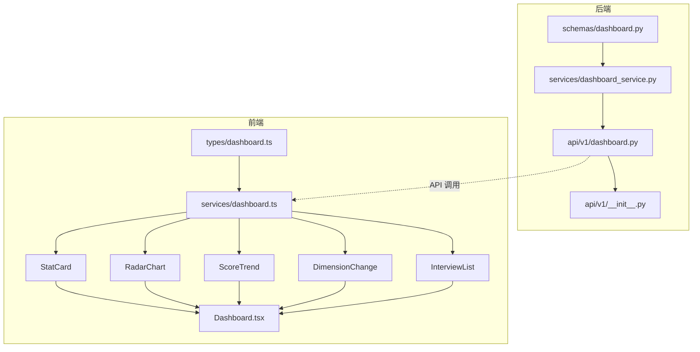

# 综合仪表盘技术实现规划

## 文档信息
- **创建日期**: 2026-02-13
- **功能名称**: 综合仪表盘技术实现
- **文档类型**: TASK - 技术实现规划与任务拆分
- **依赖文档**: [DESIGN_dashboard.md](./DESIGN_dashboard.md)

---

## 1. 实现范围

### 1.1 包含内容
- 后端仪表盘数据聚合 API
- 前端仪表盘页面重构
- 数据可视化组件（雷达图、折线图）

### 1.2 不包含内容
- 简历管理功能本身（已存在）
- AI 面试功能本身（已存在）
- 用户认证（已存在）

---

## 2. 技术方案

### 2.1 后端实现

#### 2.1.1 新增文件

| 文件路径 | 说明 |
|---------|------|
| `backend/app/api/v1/dashboard.py` | 仪表盘路由 |
| `backend/app/services/dashboard_service.py` | 仪表盘数据聚合服务 |
| `backend/app/schemas/dashboard.py` | 仪表盘数据模型 |

#### 2.1.2 修改文件

| 文件路径 | 修改内容 |
|---------|---------|
| `backend/app/api/v1/__init__.py` | 注册仪表盘路由 |

#### 2.1.3 核心算法

**连续练习天数计算**:
```python
async def calculate_streak_days(
    db: AsyncSession,
    user_id: int
) -> int:
    """计算连续练习天数。"""
    from datetime import datetime, timedelta
    from sqlalchemy import select, func
    from app.models.interview import InterviewSession
    
    # 获取所有面试日期（去重）
    result = await db.execute(
        select(
            func.distinct(
                func.date(InterviewSession.start_time)
            ).label("interview_date")
        )
        .where(
            InterviewSession.user_id == user_id,
            InterviewSession.status == "completed"
        )
        .order_by("interview_date")
    )
    dates = [row.interview_date for row in result.all()]
    
    if not dates:
        return 0
    
    today = datetime.now().date()
    streak = 0
    check_date = today
    
    # 如果今天没有面试，从昨天开始算
    if check_date not in dates:
        check_date = today - timedelta(days=1)
    
    # 倒序检查连续天数
    date_set = set(dates)
    while check_date in date_set:
        streak += 1
        check_date -= timedelta(days=1)
    
    return streak
```

**维度平均分计算**:
```python
async def get_dimension_scores(
    db: AsyncSession,
    user_id: int,
    limit: int = 3
) -> Optional[Dict[str, int]]:
    """获取最近 N 场面试的维度平均分。"""
    from sqlalchemy import select, func
    from app.models.interview import InterviewSession, InterviewEvaluation
    
    result = await db.execute(
        select(InterviewEvaluation)
        .join(InterviewSession)
        .where(
            InterviewSession.user_id == user_id,
            InterviewSession.status == "completed"
        )
        .order_by(InterviewEvaluation.created_at.desc())
        .limit(limit)
    )
    evaluations = result.scalars().all()
    
    if not evaluations:
        return None
    
    # 计算各维度平均
    count = len(evaluations)
    return {
        "communication": round(
            sum(e.dimension_scores["communication"] for e in evaluations) / count
        ),
        "technical_depth": round(
            sum(e.dimension_scores["technical_depth"] for e in evaluations) / count
        ),
        "project_experience": round(
            sum(e.dimension_scores["project_experience"] for e in evaluations) / count
        ),
        "adaptability": round(
            sum(e.dimension_scores["adaptability"] for e in evaluations) / count
        ),
        "job_match": round(
            sum(e.dimension_scores["job_match"] for e in evaluations) / count
        ),
    }
```

---

### 2.2 前端实现

#### 2.2.1 新增文件

| 文件路径 | 说明 |
|---------|------|
| `frontend/src/services/dashboard.ts` | 仪表盘 API 服务 |
| `frontend/src/types/dashboard.ts` | 仪表盘类型定义 |
| `frontend/src/components/dashboard/StatCard.tsx` | 统计指标卡片组件 |
| `frontend/src/components/dashboard/RadarChart.tsx` | 能力雷达图组件 |
| `frontend/src/components/dashboard/ScoreTrend.tsx` | 分数趋势折线图组件 |
| `frontend/src/components/dashboard/InterviewList.tsx` | 最近面试列表组件 |
| `frontend/src/components/dashboard/DimensionChange.tsx` | 维度变化展示组件 |

#### 2.2.2 修改文件

| 文件路径 | 修改内容 |
|---------|---------|
| `frontend/src/pages/Home/Dashboard.tsx` | 重构仪表盘页面 |

#### 2.2.3 依赖安装

```bash
cd frontend
npm install recharts
```

---

## 3. 任务拆分

### 阶段 1: 后端 API 开发

#### 任务 1.1: 创建数据模型
**文件**: `backend/app/schemas/dashboard.py`
**输入**: 设计文档中的数据结构
**输出**: Pydantic 模型类
**验收标准**:
- [ ] DashboardStats 模型
- [ ] InterviewStats 模型
- [ ] DashboardData 模型
- [ ] 所有字段类型正确

#### 任务 1.2: 创建服务层
**文件**: `backend/app/services/dashboard_service.py`
**输入**: 数据模型、现有 interview/resume 服务
**输出**: DashboardService 类
**验收标准**:
- [ ] get_dashboard_data 方法
- [ ] calculate_streak_days 方法
- [ ] get_dimension_scores 方法
- [ ] get_score_trend 方法
- [ ] get_dimension_changes 方法
- [ ] generate_insight 方法

#### 任务 1.3: 创建 API 路由
**文件**: `backend/app/api/v1/dashboard.py`
**输入**: DashboardService
**输出**: FastAPI 路由
**验收标准**:
- [ ] GET /api/v1/dashboard 接口
- [ ] 响应格式符合设计文档
- [ ] 错误处理完善

#### 任务 1.4: 注册路由
**文件**: `backend/app/api/v1/__init__.py`
**输入**: dashboard 路由
**输出**: 注册代码
**验收标准**:
- [ ] 路由正常注册
- [ ] API 文档正常显示

---

### 阶段 2: 前端组件开发

#### 任务 2.1: 创建类型定义
**文件**: `frontend/src/types/dashboard.ts`
**输入**: 后端 API 响应格式
**输出**: TypeScript 类型
**验收标准**:
- [ ] DashboardData 接口
- [ ] DashboardStats 接口
- [ ] InterviewStats 接口
- [ ] 所有类型与后端一致

#### 任务 2.2: 创建 API 服务
**文件**: `frontend/src/services/dashboard.ts`
**输入**: 类型定义
**输出**: API 调用函数
**验收标准**:
- [ ] getDashboardData 函数
- [ ] 错误处理
- [ ] 类型安全

#### 任务 2.3: 创建统计卡片组件
**文件**: `frontend/src/components/dashboard/StatCard.tsx`
**输入**: 设计文档
**输出**: 可复用的统计卡片组件
**验收标准**:
- [ ] 显示图标、数值、标签
- [ ] 支持点击跳转
- [ ] 响应式样式
- [ ] 加载状态

#### 任务 2.4: 创建雷达图组件
**文件**: `frontend/src/components/dashboard/RadarChart.tsx`
**输入**: recharts 库、设计文档
**输出**: 能力雷达图组件
**验收标准**:
- [ ] 5 维度雷达图
- [ ] 显示近3场均分
- [ ] 样式美观
- [ ] 响应式

#### 任务 2.5: 创建分数趋势组件
**文件**: `frontend/src/components/dashboard/ScoreTrend.tsx`
**输入**: recharts 库、设计文档
**输出**: 折线图组件
**验收标准**:
- [ ] 近10场面试趋势
- [ ] 悬停提示
- [ ] 响应式

#### 任务 2.6: 创建维度变化组件
**文件**: `frontend/src/components/dashboard/DimensionChange.tsx`
**输入**: 设计文档
**输出**: 维度变化展示组件
**验收标准**:
- [ ] 显示5维度变化
- [ ] 上升/下降/持平箭头
- [ ] 数值变化显示

#### 任务 2.7: 创建最近面试列表组件
**文件**: `frontend/src/components/dashboard/InterviewList.tsx`
**输入**: 设计文档
**输出**: 面试列表组件
**验收标准**:
- [ ] 显示2-3条最近面试
- [ ] 企业、岗位、分数、时间
- [ ] 点击跳转
- [ ] 空状态

---

### 阶段 3: 页面整合

#### 任务 3.1: 重构仪表盘页面
**文件**: `frontend/src/pages/Home/Dashboard.tsx`
**输入**: 所有组件
**输出**: 完整仪表盘页面
**验收标准**:
- [ ] 50/50 布局
- [ ] 核心指标区
- [ ] 简历管理区
- [ ] 面试练习区
- [ ] 成长趋势区
- [ ] 所有空状态
- [ ] 响应式布局
- [ ] 加载状态
- [ ] 错误处理

---

### 阶段 4: 测试与优化

#### 任务 4.1: 后端测试
**验收标准**:
- [ ] API 单元测试
- [ ] 服务层单元测试
- [ ] 数据计算准确性验证

#### 任务 4.2: 前端测试
**验收标准**:
- [ ] 组件单元测试
- [ ] 页面集成测试
- [ ] 响应式测试

#### 任务 4.3: 性能优化
**验收标准**:
- [ ] 接口响应 < 500ms
- [ ] 页面首屏 < 2s
- [ ] 图表渲染流畅

---

## 4. 依赖关系图



---

## 5. 接口契约

### 5.1 请求

```
GET /api/v1/dashboard
Authorization: Bearer <token>
```

### 5.2 响应

```json
{
  "code": 200,
  "message": "success",
  "data": {
    "stats": {
      "resumeCount": 5,
      "interviewCount": 12,
      "averageScore": 78,
      "streakDays": 5
    },
    "recentResumes": [
      {
        "id": 1,
        "resume_name": "AI应用工程师",
        "location": "广东·广州",
        "updated_at": "2026-02-13T10:30:00"
      }
    ],
    "interviewStats": {
      "dimensionScores": {
        "communication": 80,
        "technical_depth": 75,
        "project_experience": 82,
        "adaptability": 78,
        "job_match": 80
      },
      "recentInterviews": [
        {
          "id": 1,
          "companyName": "字节跳动",
          "positionName": "前端工程师",
          "overallScore": 82,
          "startTime": "2026-02-11T14:00:00"
        }
      ],
      "scoreTrend": [
        {
          "sessionId": 1,
          "companyName": "字节跳动",
          "overallScore": 82,
          "startTime": "2026-02-11T14:00:00"
        }
      ],
      "dimensionChanges": [
        {
          "key": "technical_depth",
          "name": "技术深度",
          "current": 82,
          "previous": 75,
          "change": 7
        }
      ],
      "insight": "技术深度提升明显，继续保持！"
    }
  }
}
```

---

## 6. 风险与应对

| 风险 | 影响 | 应对措施 |
|-----|------|---------|
| 数据量大时接口慢 | 用户体验差 | 添加缓存、分页 |
| 图表库体积大 | 首屏加载慢 | 按需加载、代码分割 |
| 数据计算复杂 | 服务器压力大 | 异步计算、缓存结果 |

---

## 7. 验收清单

### 7.1 功能验收
- [ ] 仪表盘正常展示 4 个核心指标
- [ ] 简历管理区展示最近编辑的简历
- [ ] 面试练习区展示雷达图和最近面试
- [ ] 成长趋势区展示分数趋势和洞察
- [ ] 各模块空状态正常显示
- [ ] 响应式布局在各尺寸正常显示

### 7.2 性能验收
- [ ] 页面首屏加载 < 2s
- [ ] 数据接口响应 < 500ms
- [ ] 图表渲染流畅无卡顿

### 7.3 代码质量
- [ ] 后端代码符合项目规范
- [ ] 前端代码符合项目规范
- [ ] 单元测试覆盖率 > 80%

---

## 8. 相关文档

- [DESIGN_dashboard.md](./DESIGN_dashboard.md) - 产品设计方案
- [../ai-interviewer/DESIGN_ai-interviewer.md](../ai-interviewer/DESIGN_ai-interviewer.md) - AI 面试官系统设计

---

*文档版本: v1.0*
*最后更新: 2026-02-13*
