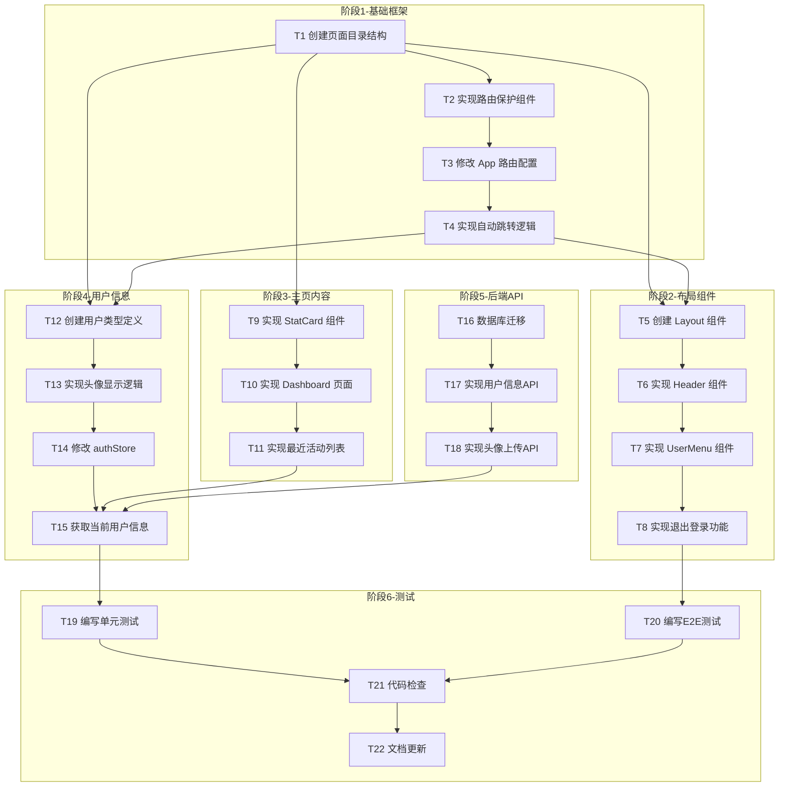

# MoonLight 主页功能设计文档

> 项目代号：MoonLight（月光）
> 创建日期：2026-02-02
> 文档版本：v1.0
> 基于：01-login-system-design.md

---

## 1. 项目概述

### 1.1 文档目的
本文档定义登录成功后进入的主页功能设计，包括基础布局、导航结构、用户信息展示和退出登录功能。

### 1.2 设计背景
在完成基础登录/注册功能后，需要实现用户认证成功后的跳转页面，提供基础的系统入口框架。

### 1.3 设计目标
- 提供符合大厂风格的基础页面布局
- 实现登录保护机制
- 支持用户信息展示（用户名 + 头像）
- 提供退出登录功能
- 为后续功能扩展预留框架

---

## 2. 功能设计

### 2.1 页面整体布局

```
┌─────────────────────────────────────────────────────────────────┐
│  🌙 MoonLight    仪表盘    项目    团队    设置          👤 张三│
├─────────────────────────────────────────────────────────────────┤
│                                                                 │
│    👋 欢迎回来，张三！                                          │
│                                                                 │
│    ┌─────────────┐  ┌─────────────┐  ┌─────────────┐  ┌──────┐ │
│    │   待处理    │  │   已完成    │  │   进行中    │  │ 总计 │ │
│    │     12     │  │     45      │  │     8      │  │  65  │ │
│    └─────────────┘  └─────────────┘  └─────────────┘  └──────┘ │
│                                                                 │
│    📋 最近活动                                                 │
│    ┌─────────────────────────────────────────────────────┐     │
│    │ • 完成任务 "用户认证模块"           2小时前         │     │
│    │ • 更新了文档 "API 接口规范"         5小时前         │     │
│    │ • 提交了代码变更                   昨天             │     │
│    └─────────────────────────────────────────────────────┘     │
│                                                                 │
└─────────────────────────────────────────────────────────────────┘
```

### 2.2 顶部导航栏设计

#### 布局结构
```
┌──────────────────────────────────────────────────────────────────┐
│ Logo          [仪表盘]    [项目]    [团队]    [设置]        👤 用户│
└──────────────────────────────────────────────────────────────────┘
```

| 元素 | 描述 |
|------|------|
| **Logo 区域** | 左侧，月亮图标 + "MoonLight" 文字 |
| **导航菜单** | 居中，4个菜单项（预留后续扩展） |
| **用户区域** | 右侧，头像 + 用户名 + 下拉菜单 |

#### 导航菜单项（预留）
| 菜单项 | 路由 | 状态 | 说明 |
|--------|------|------|------|
| 仪表盘 | /home | 当前 | 主页默认显示 |
| 项目 | /projects | 预留 | 后续功能 |
| 团队 | /team | 预留 | 后续功能 |
| 设置 | /settings | 预留 | 后续功能 |

### 2.3 用户头像系统

#### 头像来源优先级
1. **用户上传**：用户自定义头像（最高优先级）
2. **默认头像**：系统提供的默认头像（兜底）

#### 默认头像设计
- 纯色背景 + 用户名首字母
- 颜色从预设配色中随机选择
- 示例：张三 → "Z" + 紫色圆形背景

### 2.4 退出登录流程

```
用户点击头像 → 下拉菜单出现 → 点击"退出登录" → 确认弹窗 → 清除认证状态 → 跳转登录页
```

---

## 3. 数据库设计

### 3.1 用户表扩展

在现有 `users` 表基础上添加 `avatar_url` 字段：

```sql
ALTER TABLE users ADD COLUMN avatar_url VARCHAR(512) DEFAULT NULL;
```

### 3.2 用户表完整结构

```sql
CREATE TABLE users (
    id              SERIAL PRIMARY KEY,
    email           VARCHAR(255) UNIQUE NOT NULL,
    username        VARCHAR(20) UNIQUE NOT NULL,
    password_hash   VARCHAR(255) NOT NULL,
    avatar_url      VARCHAR(512) DEFAULT NULL,  -- 用户头像URL
    is_active       BOOLEAN DEFAULT TRUE,
    created_at      TIMESTAMP WITH TIME ZONE DEFAULT CURRENT_TIMESTAMP,
    updated_at      TIMESTAMP WITH TIME ZONE DEFAULT CURRENT_TIMESTAMP
);

CREATE INDEX idx_users_email ON users(email);
CREATE INDEX idx_users_username ON users(username);
```

### 3.3 头像存储方案

| 环境 | 存储位置 |
|------|----------|
| 本地开发 | `frontend/public/uploads/avatars/` |
| Docker/生产 | 建议使用对象存储（如 S3、OSS） |

---

## 4. 技术架构

### 4.1 前端架构扩展

```
frontend/src/
├── components/
│   ├── layout/
│   │   ├── Layout.tsx              # 布局容器
│   │   ├── Header.tsx              # 顶部导航栏
│   │   └── UserMenu.tsx            # 用户下拉菜单
│   └── ui/
│       └── avatar.tsx              # 头像组件（复用或新建）
├── pages/
│   ├── Home/
│   │   ├── index.tsx               # 主页入口
│   │   ├── Dashboard.tsx           # 仪表盘页面
│   │   └── StatCard.tsx            # 统计卡片组件
│   └── Login/
│       └── index.tsx               # 修改：登录成功后跳转
├── services/
│   └── user.ts                     # 用户相关API（头像上传）
├── stores/
│   └── authStore.ts                # 修改：增加头像相关逻辑
├── hooks/
│   └── useAuth.ts                  # 新增：认证相关Hooks
└── types/
    └── user.ts                     # 新增：用户类型定义
```

### 4.2 后端 API 扩展

| 操作 | 方法 | 路径 | 说明 |
|------|------|------|------|
| 获取用户信息 | GET | /api/v1/users/me | 返回当前用户完整信息（含头像）|
| 更新用户信息 | PUT | /api/v1/users/me | 更新用户基本信息 |
| 上传头像 | POST | /api/v1/users/me/avatar | 上传并更新用户头像 |

### 4.3 路由保护机制

```typescript
// 路由配置
const router = createBrowserRouter([
  {
    path: '/',
    element: <RootLayout />,
    children: [
      {
        index: true,
        element: <LandingPage />,  // 落地页（已登录自动跳转）
      },
      {
        path: 'login',
        element: <LoginPage />,    // 登录页（已登录自动跳转）
      },
      {
        path: 'home',
        element: (
          <ProtectedRoute>
            <HomePage />
          </ProtectedRoute>
        ),
      },
      // 预留路由
      {
        path: 'projects',
        element: <ComingSoon />,
      },
      {
        path: 'team',
        element: <ComingSoon />,
      },
      {
        path: 'settings',
        element: <ComingSoon />,
      },
    ],
  },
]);
```

---

## 5. 实现计划

### 5.1 原子化任务拆分

#### 阶段 1：基础框架搭建
| 序号 | 任务名称 | 描述 | 依赖 | 验收标准 |
|------|----------|------|------|----------|
| T1 | 创建页面目录结构 | 新建 Home 页面目录 | 无 | 目录结构符合设计 |
| T2 | 实现路由保护组件 | 创建 ProtectedRoute 组件 | 无 | 未登录访问 /home 跳转到 /login |
| T3 | 修改 App 路由配置 | 更新 React Router 配置 | T2 | 路由保护生效 |
| T4 | 实现自动跳转逻辑 | 落地页和登录页检测登录状态 | T3 | 已登录用户访问 / 或 /login 跳转到 /home |

#### 阶段 2：布局组件开发
| 序号 | 任务名称 | 描述 | 依赖 | 验收标准 |
|------|----------|------|------|----------|
| T5 | 创建 Layout 组件 | 顶部导航 + 主内容区容器 | T1 | 布局组件可复用 |
| T6 | 实现 Header 组件 | 顶部导航栏（Logo + 菜单 + 用户） | T5 | 导航栏显示正常 |
| T7 | 实现 UserMenu 组件 | 用户下拉菜单（头像 + 退出） | T6 | 下拉菜单交互正常 |
| T8 | 实现退出登录功能 | 清除认证状态并跳转 | T7 | 退出后跳转登录页 |

#### 阶段 3：主页内容开发
| 序号 | 任务名称 | 描述 | 依赖 | 验收标准 |
|------|----------|------|------|----------|
| T9 | 实现 StatCard 组件 | 统计卡片组件 | T1 | 卡片可复用 |
| T10 | 实现 Dashboard 页面 | 主页仪表盘（问候语 + 卡片） | T9, T5 | 页面布局正确 |
| T11 | 实现最近活动列表 | 活动列表组件 | T10 | 列表展示正常 |

#### 阶段 4：用户信息集成
| 序号 | 任务名称 | 描述 | 依赖 | 验收标准 |
|------|----------|------|------|----------|
| T12 | 创建用户类型定义 | user.ts 类型文件 | 无 | 类型定义完整 |
| T13 | 实现头像显示逻辑 | 根据 avatar_url 或首字母显示头像 | T12 | 头像显示正确 |
| T14 | 修改 authStore | 增加头像相关状态和方法 | T12 | 状态管理正确 |
| T15 | 获取当前用户信息 | 调用 /api/v1/users/me | T14 | 用户信息正确显示 |

#### 阶段 5：后端 API 开发
| 序号 | 任务名称 | 描述 | 依赖 | 验收标准 |
|------|----------|------|------|----------|
| T16 | 数据库迁移 | 添加 avatar_url 字段 | 无 | 字段添加成功 |
| T17 | 实现用户信息 API | /api/v1/users/me 接口 | T16 | API 正常工作 |
| T18 | 实现头像上传 API | /api/v1/users/me/avatar | T17 | 上传功能正常 |

#### 阶段 6：测试与完善
| 序号 | 任务名称 | 描述 | 依赖 | 验收标准 |
|------|----------|------|------|----------|
| T19 | 编写单元测试 | 核心组件测试 | T15 | 测试覆盖 > 80% |
| T20 | 编写 E2E 测试 | 用户流程测试 | T8 | 登录→主页→退出 流程正常 |
| T21 | 代码检查 | ESLint + TypeScript | 全部 | 无错误警告 |
| T22 | 文档更新 | 更新项目文档 | 全部 | 文档同步 |

### 5.2 任务依赖图



### 5.3 里程碑规划

| 里程碑 | 完成任务 | 预计工时 | 交付物 |
|--------|----------|----------|--------|
| M1-基础路由 | T1-T4 | 2小时 | 路由保护生效 |
| M2-布局完成 | T5-T8 | 3小时 | 布局组件可用 |
| M3-主页就绪 | T9-T15 | 4小时 | 主页功能完整 |
| M4-后端对接 | T16-T18 | 3小时 | API 正常工作 |
| M5-测试通过 | T19-T22 | 3小时 | 全量测试通过 |

**总计预计工时：15小时**

---

## 6. 验收标准

### 6.1 功能验收标准

| 场景 | 预期行为 | 测试方法 |
|------|----------|----------|
| 未登录访问 /home | 跳转到 /login | 手动测试 / E2E |
| 已登录访问 / | 跳转到 /home | 手动测试 / E2E |
| 已登录访问 /login | 跳转到 /home | 手动测试 / E2E |
| 点击退出登录 | 清除状态，跳转登录页 | 手动测试 / E2E |
| 头像显示 | 优先显示上传图片，否则显示首字母 | 手动测试 |
| 刷新页面 | 用户状态保持 | 手动测试 |

### 6.2 界面验收标准

| 检查项 | 标准 |
|--------|------|
| 响应式适配 | 1024px 以上正常显示 |
| 主题切换 | 深色/浅色模式正常切换 |
| 动画效果 | 页面加载有淡入动画 |
| 布局一致性 | 与登录页风格统一 |

### 6.3 代码验收标准

| 检查项 | 标准 |
|--------|------|
| TypeScript | 无 any，类型完整 |
| ESLint | 无错误 |
| 测试覆盖率 | > 80% |
| 代码注释 | 函数级注释完整 |

---

## 7. 后续扩展规划

### 7.1 预留功能

| 功能 | 路由 | 说明 |
|------|------|------|
| 项目管理 | /projects | 项目列表、创建、详情 |
| 团队协作 | /team | 团队成员、管理 |
| 系统设置 | /settings | 个人信息、偏好设置 |

### 7.2 头像系统扩展

| 功能 | 优先级 | 说明 |
|------|--------|------|
| 头像裁剪 | P1 | 上传后支持裁剪 |
| 头像相册 | P2 | 多个头像选择 |
| 头像审核 | P3 | 敏感内容过滤 |

---

## 8. 风险评估

| 风险 | 可能性 | 影响 | 应对措施 |
|------|--------|------|----------|
| 后端 API 未完成 | 中 | 前端无法获取用户信息 | 先用 mock 数据开发 |
| 头像存储方案复杂 | 低 | 上传功能延迟 | 先用 base64，后续迁移 |

---

## 9. 参考资料

### 9.1 设计参考
- [Linear Dashboard](https://linear.app) - 极简风格
- [Notion Dashboard](https://notion.so) - 卡片布局
- [Vercel Dashboard](https://vercel.com) - 顶部导航模式

### 9.2 技术参考
- [React Router v6](https://reactrouter.com)
- [Zustand](https://zustand-demo.pmnd.rs)
- [Tailwind CSS](https://tailwindcss.com)

---

## 10. 附录

### 10.1 颜色变量定义

```css
/* 头像背景色预设 */
.avatar-bg-1 { background: linear-gradient(135deg, #667eea 0%, #764ba2 100%); }
.avatar-bg-2 { background: linear-gradient(135deg, #f093fb 0%, #f5576c 100%); }
.avatar-bg-3 { background: linear-gradient(135deg, #4facfe 0%, #00f2fe 100%); }
.avatar-bg-4 { background: linear-gradient(135deg, #43e97b 0%, #38f9d7 100%); }
.avatar-bg-5 { background: linear-gradient(135deg, #fa709a 0%, #fee140 100%); }
```

### 10.2 组件接口定义

```typescript
// UserMenu 下拉菜单 Props
interface UserMenuProps {
  username: string;
  avatarUrl?: string;
  onLogout: () => void;
}

// StatCard 统计卡片 Props
interface StatCardProps {
  title: string;
  value: number | string;
  icon?: React.ReactNode;
  trend?: {
    value: number;
    direction: 'up' | 'down' | 'neutral';
  };
}
```

---

## 11. 变更记录

| 版本 | 日期 | 变更内容 |
|------|------|----------|
| v1.0 | 2026-02-02 | 初始版本，定义主页功能设计 |

---

*文档结束*
