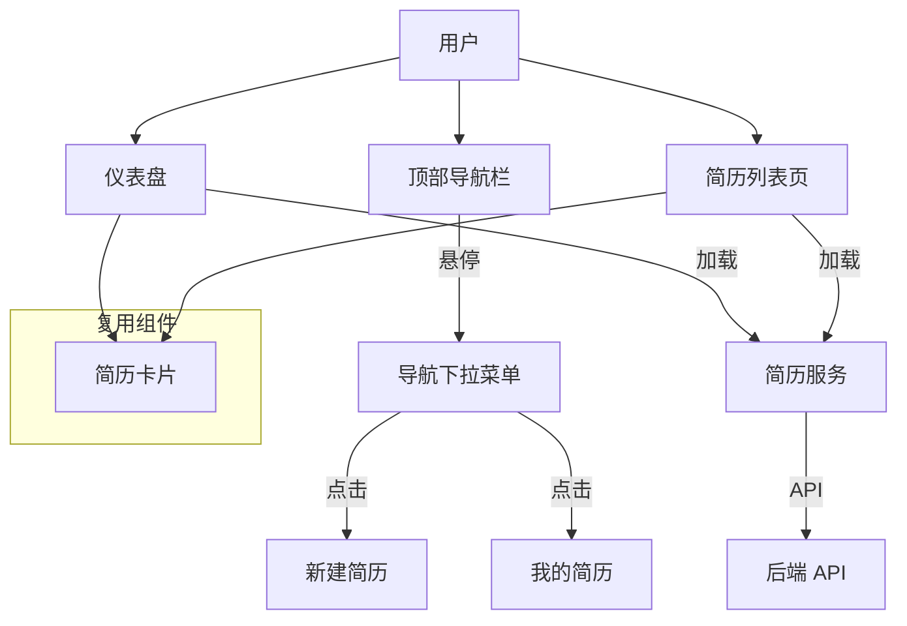

# DESIGN: 主页重构与简历管理系统设计

## 1. 系统分层设计

### 1.1 整体架构
本任务主要涉及前端视图层 (View Layer) 和 业务逻辑层 (Service Layer) 的增强。



### 1.2 目录结构调整
```
frontend/src/
├── components/
│   ├── layout/
│   │   └── Header.tsx          # 修改：添加简历管理下拉
│   └── resume/                 # 新增：简历相关组件
│       └── ResumeCard.tsx      # 新增：简历展示卡片
├── pages/
│   ├── Home/
│   │   └── Dashboard.tsx       # 修改：接入真实数据
│   └── Resume/
│       ├── ResumeList.tsx      # 新增：简历列表页
│       └── index.tsx           # 修改：导出 ResumeList
```

## 2. 模块设计

### 2.1 简历卡片 (ResumeCard)
展示单个简历的简要信息，支持操作。

- **Props**:
  - `resume`: ResumeBase (简历数据)
  - `onEdit`: (id) => void
  - `onCopy`: (id) => void
  - `onDelete`: (id) => void
  - `showActions`: boolean (是否显示完整操作，仪表盘可能只显示编辑)

### 2.2 简历列表页 (ResumeList)
展示所有简历，分页加载。

- **State**:
  - `resumes`: ResumeBase[]
  - `loading`: boolean
  - `pagination`: { page, pageSize, total }
- **Logic**:
  - `useEffect`: 调用 `getResumeList`
  - `handleCopy`: 调用 `getResumeDetail` -> 清理 -> `createResume` -> 刷新列表
  - `handleDelete`: 调用 `deleteResume` -> 刷新列表

### 2.3 仪表盘 (Dashboard)
展示概览和最近简历。

- **State**:
  - `recentResumes`: ResumeBase[] (Top 5)
  - `loading`: boolean
- **Logic**:
  - `useEffect`: 调用 `getResumeList(1, 5)`

### 2.4 导航栏 (Header)
- **Logic**:
  - 使用 Shadcn UI 的 `DropdownMenu` 或自定义 Hover 逻辑实现下拉。
  - 菜单项: "新建简历", "我的简历"。

## 3. 接口契约

### 3.1 复制简历逻辑 (Frontend)
```typescript
const handleCopy = async (id: number) => {
  // 1. 获取详情
  const original = await getResumeDetail(id);
  // 2. 构建新数据
  const newData: ResumeFormData = {
    ...original,
    title: `${original.title} (副本)`,
    // 移除 ID 和 元数据
    id: undefined,
    created_at: undefined,
    updated_at: undefined,
    user_id: undefined
  };
  // 3. 创建
  await createResume(newData);
};
```

## 4. 数据流向
1. **查看**: Page -> useEffect -> Service.getResumeList -> API -> State -> Render
2. **复制**: Button -> handleCopy -> Service.getResumeDetail -> Service.createResume -> API -> Refresh List
