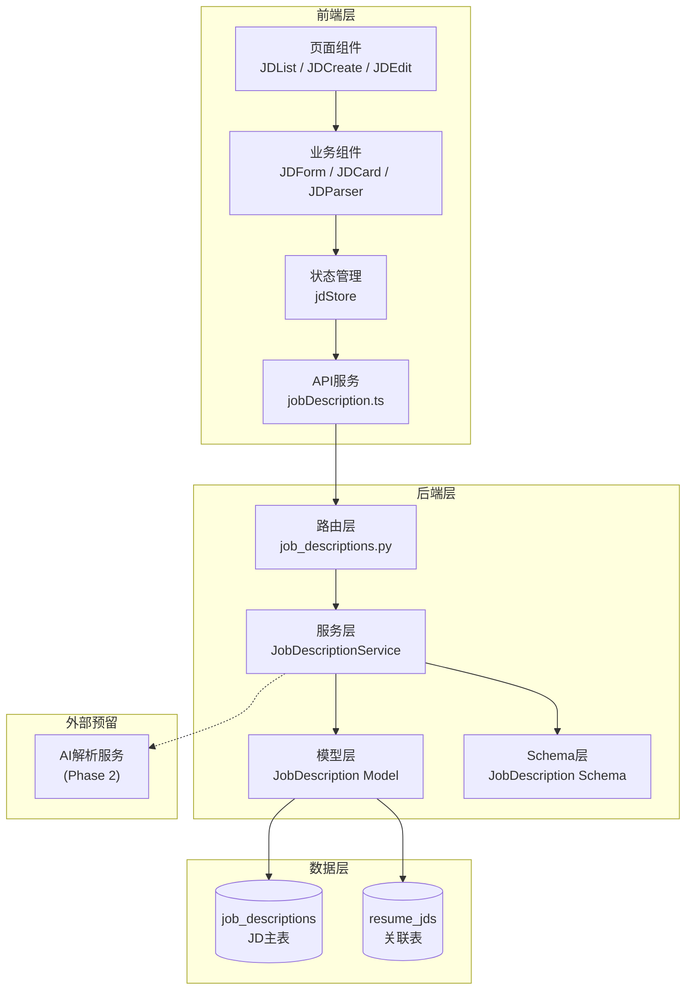
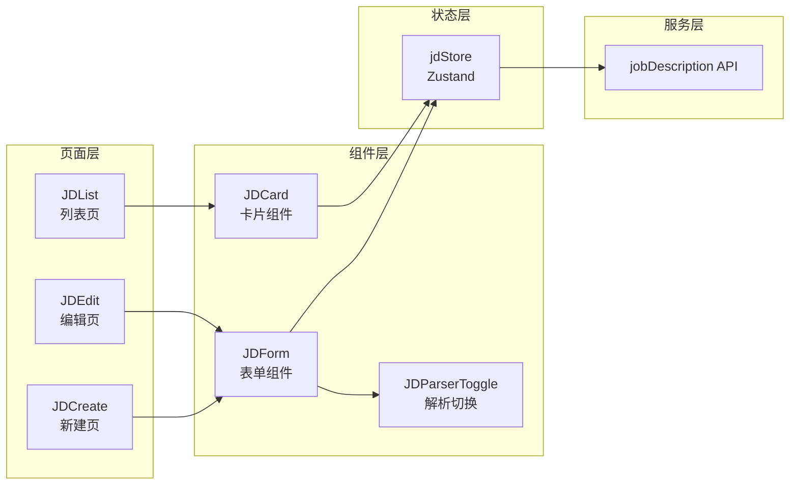
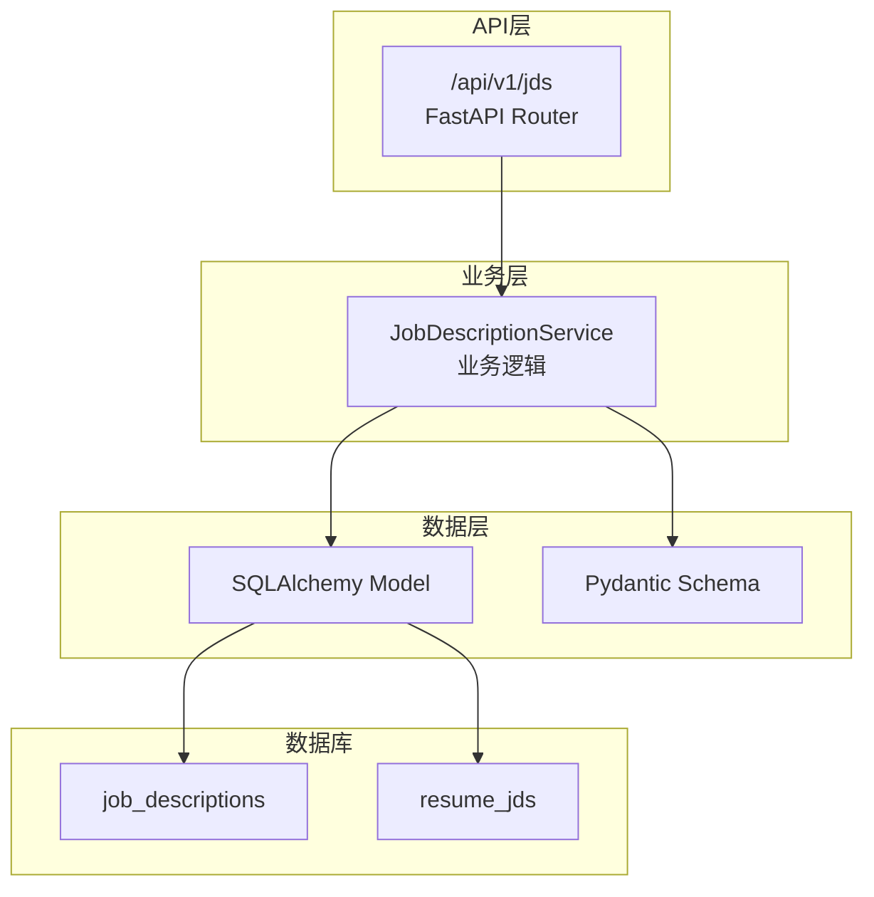
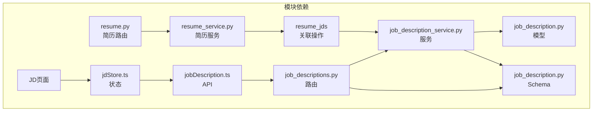
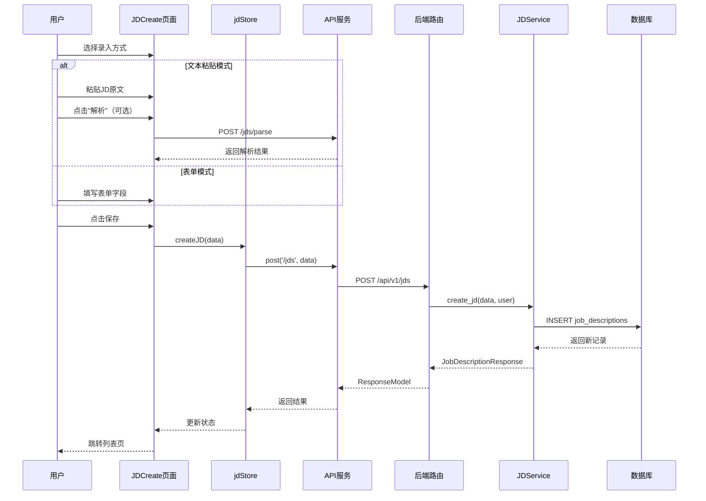
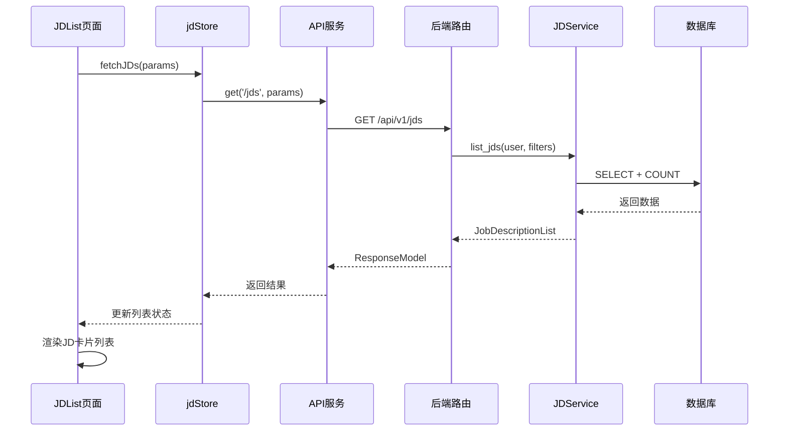
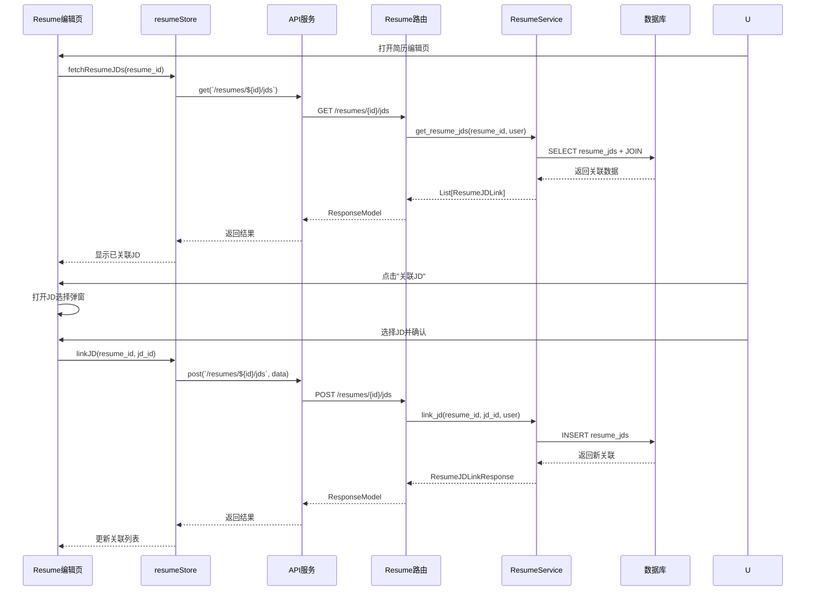

# JD管理功能 - 设计文档

## 文档信息
- **任务名称**: 企业JD（职位描述）管理功能
- **创建日期**: 2026-02-25
- **文档类型**: DESIGN (设计阶段)
- **前置文档**: CONSENSUS_job-description.md

---

## 1. 整体架构图



---

## 2. 分层设计

### 2.1 前端架构



### 2.2 后端架构



---

## 3. 模块依赖关系



---

## 4. 接口契约定义

### 4.1 后端API详细定义

#### JD管理接口

```python
# ==================== Schema定义 ====================

class JobDescriptionBase(BaseModel):
    """JD基础Schema"""
    company_name: str = Field(..., max_length=100, description="公司名称")
    position_name: str = Field(..., max_length=100, description="职位名称")
    description: str = Field(..., description="职位描述（含任职要求）")
    salary_range: Optional[str] = Field(None, max_length=50, description="薪资范围")
    location: Optional[str] = Field(None, max_length=100, description="工作地点")
    raw_text: Optional[str] = Field(None, description="原始文本")
    source: Optional[str] = Field(None, max_length=50, description="来源平台")
    url: Optional[str] = Field(None, description="原始链接")
    tags: Optional[List[str]] = Field(default=[], description="标签列表")

class JobDescriptionCreate(JobDescriptionBase):
    """创建JD请求"""
    pass

class JobDescriptionUpdate(BaseModel):
    """更新JD请求（所有字段可选）"""
    company_name: Optional[str] = Field(None, max_length=100)
    position_name: Optional[str] = Field(None, max_length=100)
    description: Optional[str] = None
    salary_range: Optional[str] = Field(None, max_length=50)
    location: Optional[str] = Field(None, max_length=100)
    raw_text: Optional[str] = None
    source: Optional[str] = Field(None, max_length=50)
    url: Optional[str] = None
    tags: Optional[List[str]] = None

class JobDescriptionResponse(JobDescriptionBase):
    """JD响应"""
    id: int
    user_id: int
    created_at: datetime
    updated_at: datetime
    model_config = ConfigDict(from_attributes=True)

class JobDescriptionList(BaseModel):
    """JD列表响应"""
    items: List[JobDescriptionResponse]
    total: int
    page: int
    page_size: int

# ==================== 路由定义 ====================

@router.post("", response_model=ResponseModel[JobDescriptionResponse])
async def create_jd(
    data: JobDescriptionCreate,
    current_user: User = Depends(get_current_user),
    service: JobDescriptionService = Depends(get_jd_service)
) -> ResponseModel[JobDescriptionResponse]:
    """创建JD"""
    pass

@router.get("", response_model=ResponseModel[JobDescriptionList])
async def list_jds(
    page: int = Query(1, ge=1),
    page_size: int = Query(10, ge=1, le=100),
    keyword: Optional[str] = Query(None, description="搜索关键词"),
    tag: Optional[str] = Query(None, description="标签筛选"),
    current_user: User = Depends(get_current_user),
    service: JobDescriptionService = Depends(get_jd_service)
) -> ResponseModel[JobDescriptionList]:
    """获取JD列表"""
    pass

@router.get("/{jd_id}", response_model=ResponseModel[JobDescriptionResponse])
async def get_jd(
    jd_id: int,
    current_user: User = Depends(get_current_user),
    service: JobDescriptionService = Depends(get_jd_service)
) -> ResponseModel[JobDescriptionResponse]:
    """获取JD详情"""
    pass

@router.put("/{jd_id}", response_model=ResponseModel[JobDescriptionResponse])
async def update_jd(
    jd_id: int,
    data: JobDescriptionUpdate,
    current_user: User = Depends(get_current_user),
    service: JobDescriptionService = Depends(get_jd_service)
) -> ResponseModel[JobDescriptionResponse]:
    """更新JD"""
    pass

@router.delete("/{jd_id}", response_model=ResponseModel[dict])
async def delete_jd(
    jd_id: int,
    current_user: User = Depends(get_current_user),
    service: JobDescriptionService = Depends(get_jd_service)
) -> ResponseModel[dict]:
    """删除JD"""
    pass

# ==================== AI解析预留接口 ====================

class JDParseRequest(BaseModel):
    """JD解析请求"""
    raw_text: str = Field(..., min_length=10, description="原始JD文本")

class JDParseResponse(BaseModel):
    """JD解析响应"""
    company_name: Optional[str] = None
    position_name: Optional[str] = None
    description: Optional[str] = None
    salary_range: Optional[str] = None
    location: Optional[str] = None

@router.post("/parse", response_model=ResponseModel[JDParseResponse])
async def parse_jd(
    data: JDParseRequest,
    current_user: User = Depends(get_current_user)
) -> ResponseModel[JDParseResponse]:
    """解析JD文本（预留接口）"""
    # Phase 1: 返回空数据或简单正则提取
    # Phase 2: 接入AI服务
    pass
```

#### 简历关联接口

```python
class ResumeJDLinkCreate(BaseModel):
    """创建关联请求"""
    jd_id: int = Field(..., description="JD ID")
    notes: Optional[str] = Field(None, description="备注")

class ResumeJDLinkResponse(BaseModel):
    """关联响应"""
    id: int
    resume_id: int
    jd_id: int
    notes: Optional[str]
    created_at: datetime
    jd: JobDescriptionResponse  # 嵌套JD详情

# 在resume路由中增加
@router.get("/{resume_id}/jds", response_model=ResponseModel[List[ResumeJDLinkResponse]])
async def get_resume_jds(
    resume_id: int,
    current_user: User = Depends(get_current_user),
    service: ResumeService = Depends(get_resume_service)
) -> ResponseModel[List[ResumeJDLinkResponse]]:
    """获取简历关联的JD列表"""
    pass

@router.post("/{resume_id}/jds", response_model=ResponseModel[ResumeJDLinkResponse])
async def link_jd_to_resume(
    resume_id: int,
    data: ResumeJDLinkCreate,
    current_user: User = Depends(get_current_user),
    service: ResumeService = Depends(get_resume_service)
) -> ResponseModel[ResumeJDLinkResponse]:
    """关联JD到简历"""
    pass

@router.delete("/{resume_id}/jds/{jd_id}", response_model=ResponseModel[dict])
async def unlink_jd_from_resume(
    resume_id: int,
    jd_id: int,
    current_user: User = Depends(get_current_user),
    service: ResumeService = Depends(get_resume_service)
) -> ResponseModel[dict]:
    """取消JD关联"""
    pass
```

### 4.2 前端类型定义

```typescript
// ==================== 基础类型 ====================

export interface JobDescription {
  id: number;
  user_id: number;
  company_name: string;
  position_name: string;
  description: string;
  salary_range?: string;
  location?: string;
  raw_text?: string;
  source?: string;
  url?: string;
  tags: string[];
  created_at: string;
  updated_at: string;
}

export interface JobDescriptionCreate {
  company_name: string;
  position_name: string;
  description: string;
  salary_range?: string;
  location?: string;
  raw_text?: string;
  source?: string;
  url?: string;
  tags?: string[];
}

export interface JobDescriptionUpdate extends Partial<JobDescriptionCreate> {}

export interface JobDescriptionList {
  items: JobDescription[];
  total: number;
  page: number;
  page_size: number;
}

export interface ResumeJDLink {
  id: number;
  resume_id: number;
  jd_id: number;
  notes?: string;
  created_at: string;
  jd: JobDescription;
}

// ==================== 表单类型 ====================

export type JDInputMode = 'form' | 'text';

export interface JDFormData {
  company_name: string;
  position_name: string;
  description: string;
  salary_range?: string;
  location?: string;
  tags: string[];
}

export interface JDTextData {
  raw_text: string;
}

// ==================== 筛选类型 ====================

export interface JDListParams {
  page?: number;
  page_size?: number;
  keyword?: string;
  tag?: string;
}
```

---

## 5. 数据流向图

### 5.1 JD创建流程



### 5.2 JD列表查询流程



### 5.3 简历关联JD流程



---

## 6. 异常处理策略

### 6.1 后端异常处理

| 异常场景 | 异常类型 | HTTP状态码 | 错误信息 |
|---------|---------|-----------|---------|
| JD不存在 | NotFoundError | 404 | "JD不存在" |
| 无权访问JD | AuthorizationError | 403 | "无权访问此JD" |
| 参数校验失败 | ValidationError | 422 | 具体字段错误 |
| 关联已存在 | ValidationError | 409 | "该JD已关联" |
| 数据库错误 | DatabaseError | 500 | "服务器内部错误" |

### 6.2 前端异常处理

```typescript
// API错误处理
const handleJDError = (error: ApiError) => {
  switch (error.status) {
    case 404:
      toast.error('JD不存在或已被删除');
      navigate('/jds');
      break;
    case 403:
      toast.error('无权访问此JD');
      break;
    case 422:
      // 表单验证错误，由react-hook-form处理
      break;
    default:
      toast.error('操作失败，请稍后重试');
  }
};

// 表单提交错误
const onSubmit = async (data: JDFormData) => {
  try {
    await createJD(data);
    toast.success('保存成功');
    navigate('/jds');
  } catch (error) {
    handleJDError(error);
  }
};
```

---

## 7. 页面设计

### 7.1 JD列表页 (JDList)

```
┌─────────────────────────────────────────────────────────────┐
│  职位JD管理                                    [+ 新建JD]   │
├─────────────────────────────────────────────────────────────┤
│  [搜索JD...]  [全部标签 ▼]                                  │
├─────────────────────────────────────────────────────────────┤
│  ┌─────────────────┐  ┌─────────────────┐                   │
│  │ 字节跳动        │  │ 阿里巴巴        │                   │
│  │ 高级前端工程师   │  │ Java开发工程师  │                   │
│  │ 30k-50k · 北京  │  │ 25k-40k · 杭州  │                   │
│  │ #前端 #React    │  │ #Java #Spring   │                   │
│  │                 │  │                 │                   │
│  │ [编辑] [删除]   │  │ [编辑] [删除]   │                   │
│  └─────────────────┘  └─────────────────┘                   │
│  ┌─────────────────┐  ┌─────────────────┐                   │
│  │ 腾讯            │  │ ...             │                   │
│  │ 产品经理        │  │                 │                   │
│  │ ...             │  │                 │                   │
│  └─────────────────┘  └─────────────────┘                   │
│                                                             │
│  [<] 1 2 3 ... 10 [>]                                       │
└─────────────────────────────────────────────────────────────┘
```

### 7.2 JD新建/编辑页 (JDCreate/JDEdit)

```
┌─────────────────────────────────────────────────────────────┐
│  < 返回列表        新建JD                                   │
├─────────────────────────────────────────────────────────────┤
│  录入方式: [表单录入 ●] [文本粘贴 ○]                        │
├─────────────────────────────────────────────────────────────┤
│                                                             │
│  公司名称 *                                                 │
│  ┌─────────────────────────────────────────────────────┐   │
│  │ 字节跳动                                             │   │
│  └─────────────────────────────────────────────────────┘   │
│                                                             │
│  职位名称 *                                                 │
│  ┌─────────────────────────────────────────────────────┐   │
│  │ 高级前端工程师                                        │   │
│  └─────────────────────────────────────────────────────┘   │
│                                                             │
│  职位描述 *                                                 │
│  ┌─────────────────────────────────────────────────────┐   │
│  │ 岗位职责：                                           │   │
│  │ 1. 负责前端架构设计...                                │   │
│  │                                                      │   │
│  │ 任职要求：                                           │   │
│  │ 1. 3年以上前端开发经验...                             │   │
│  └─────────────────────────────────────────────────────┘   │
│                                                             │
│  薪资范围              工作地点                             │
│  ┌─────────────┐      ┌─────────────┐                      │
│  │ 30k-50k     │      │ 北京         │                      │
│  └─────────────┘      └─────────────┘                      │
│                                                             │
│  标签                                                       │
│  ┌─────────────────────────────────────────────────────┐   │
│  │ 前端 React 架构师 [x]                                │   │
│  └─────────────────────────────────────────────────────┘   │
│                                                             │
│  来源链接（可选）                                            │
│  ┌─────────────────────────────────────────────────────┐   │
│  │ https://www.zhipin.com/job/xxx                       │   │
│  └─────────────────────────────────────────────────────┘   │
│                                                             │
│                                    [取消]    [保存]         │
└─────────────────────────────────────────────────────────────┘
```

### 7.3 文本粘贴模式

```
┌─────────────────────────────────────────────────────────────┐
│  录入方式: [表单录入 ○] [文本粘贴 ●]                        │
├─────────────────────────────────────────────────────────────┤
│                                                             │
│  粘贴JD原文 *                                               │
│  ┌─────────────────────────────────────────────────────┐   │
│  │ 【字节跳动】高级前端工程师                             │   │
│  │                                                      │   │
│  │ 薪资：30k-50k                                        │   │
│  │ 地点：北京                                           │   │
│  │                                                      │   │
│  │ 职位描述：                                           │   │
│  │ 1. 负责前端架构设计                                  │   │
│  │ 2. 优化前端性能                                      │   │
│  │                                                      │   │
│  │ 任职要求：                                           │   │
│  │ 1. 3年以上经验                                       │   │
│  │ 2. 精通React                                         │   │
│  └─────────────────────────────────────────────────────┘   │
│                                                             │
│  [⚡ AI解析并填充表单]                                      │
│                                                             │
│                                    [取消]    [保存]         │
└─────────────────────────────────────────────────────────────┘
```

---

## 8. 组件设计

### 8.1 组件清单

| 组件名 | 路径 | 功能 |
|--------|------|------|
| JDForm | pages/JobDescription/components/JDForm.tsx | JD表单（支持双模式） |
| JDCard | pages/JobDescription/components/JDCard.tsx | JD卡片展示 |
| JDParserToggle | pages/JobDescription/components/JDParserToggle.tsx | 录入方式切换 |
| JDTagInput | pages/JobDescription/components/JDTagInput.tsx | 标签输入组件 |
| JDLinkModal | pages/Resume/components/JDLinkModal.tsx | 简历关联JD弹窗 |
| JDLinkedList | pages/Resume/components/JDLinkedList.tsx | 已关联JD列表 |

### 8.2 关键组件接口

```typescript
// JDForm组件
interface JDFormProps {
  mode: JDInputMode;
  initialData?: Partial<JobDescription>;
  onSubmit: (data: JobDescriptionCreate) => Promise<void>;
  onModeChange: (mode: JDInputMode) => void;
  onParse?: (rawText: string) => Promise<Partial<JobDescriptionCreate>>;
  loading?: boolean;
}

// JDCard组件
interface JDCardProps {
  jd: JobDescription;
  onEdit: (id: number) => void;
  onDelete: (id: number) => void;
  showActions?: boolean;
}

// JDLinkModal组件
interface JDLinkModalProps {
  resumeId: number;
  linkedJDs: ResumeJDLink[];
  onLink: (jdId: number) => Promise<void>;
  onUnlink: (jdId: number) => Promise<void>;
  onClose: () => void;
}
```

---

## 9. 状态管理设计

```typescript
// jdStore.ts - Zustand状态管理

interface JDState {
  // 列表状态
  jdList: JobDescription[];
  total: number;
  page: number;
  pageSize: number;
  loading: boolean;
  error: string | null;

  // 当前JD状态
  currentJD: JobDescription | null;
  saving: boolean;

  // 筛选状态
  filters: {
    keyword: string;
    tag: string;
  };

  // 操作方法
  fetchJDs: (params?: JDListParams) => Promise<void>;
  fetchJD: (id: number) => Promise<void>;
  createJD: (data: JobDescriptionCreate) => Promise<JobDescription>;
  updateJD: (id: number, data: JobDescriptionUpdate) => Promise<JobDescription>;
  deleteJD: (id: number) => Promise<void>;
  setFilters: (filters: Partial<JDState['filters']>) => void;
  resetCurrentJD: () => void;
}
```

---

## 10. 测试策略

### 10.1 后端测试

```python
# 测试覆盖点
class TestJDService:
    # 创建JD
    - test_create_jd_success
    - test_create_jd_validation_error
    - test_create_jd_unauthorized

    # 查询JD
    - test_list_jds_pagination
    - test_list_jds_filter_by_keyword
    - test_list_jds_filter_by_tag
    - test_get_jd_success
    - test_get_jd_not_found
    - test_get_jd_unauthorized

    # 更新JD
    - test_update_jd_success
    - test_update_jd_not_found
    - test_update_jd_unauthorized

    # 删除JD
    - test_delete_jd_success
    - test_delete_jd_not_found
    - test_delete_jd_with_links

    # 关联功能
    - test_link_jd_to_resume_success
    - test_link_jd_already_linked
    - test_unlink_jd_from_resume
```

### 10.2 前端测试

```typescript
// 测试覆盖点
describe('JDForm', () => {
  // 表单渲染
  - should render form mode by default
  - should switch to text mode

  // 表单验证
  - should validate required fields
  - should validate max length

  // 提交
  - should submit form data
  - should handle submit error

  // AI解析
  - should call onParse when click parse button
  - should fill form with parsed data
});

describe('JDList', () => {
  // 列表渲染
  - should render jd cards
  - should show empty state

  // 搜索筛选
  - should filter by keyword
  - should filter by tag

  // 分页
  - should handle pagination
});
```

---

**文档状态**: 已完成  
**最后更新**: 2026-02-25  
**下一步**: 进入TASK阶段，拆分子任务
