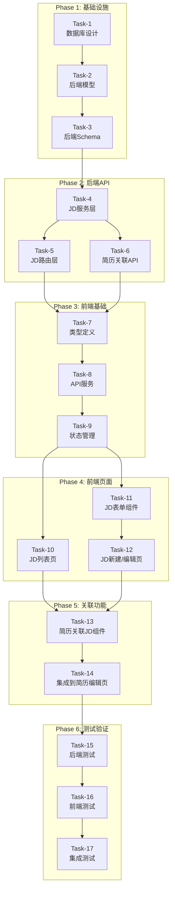
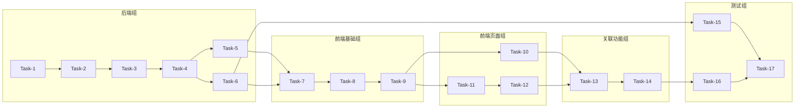

# JD管理功能 - 任务拆分文档

## 文档信息
- **任务名称**: 企业JD（职位描述）管理功能
- **创建日期**: 2026-02-25
- **文档类型**: TASK (原子化阶段)
- **前置文档**: DESIGN_job-description.md

---

## 1. 任务依赖图



---

## 2. 原子任务清单

### Task-1: 数据库设计与迁移
**优先级**: P0 | **预估耗时**: 1h | **依赖**: 无

**输入契约**:
- 数据库设计文档 (DESIGN.md)
- 现有数据库连接配置

**输出契约**:
- Alembic迁移脚本
- 数据库表创建成功

**实现约束**:
- 使用PostgreSQL数组类型存储tags
- 添加必要的索引
- 外键关联用户表和简历表

**验收标准**:
- [ ] 迁移脚本可正常执行
- [ ] 表结构符合设计规范
- [ ] 索引创建正确

---

### Task-2: 后端JD模型层
**优先级**: P0 | **预估耗时**: 1h | **依赖**: Task-1

**输入契约**:
- 数据库表结构
- 现有User模型参考

**输出契约**:
- `app/models/job_description.py`

**实现约束**:
- 复用现有BaseModel
- 添加模型关系（user, resume_links）
- 添加时间戳自动更新

**代码模板**:
```python
class JobDescription(Base):
    __tablename__ = "job_descriptions"
    
    id: Mapped[int] = mapped_column(primary_key=True)
    user_id: Mapped[int] = mapped_column(ForeignKey("users.id"))
    company_name: Mapped[str] = mapped_column(String(100))
    position_name: Mapped[str] = mapped_column(String(100))
    description: Mapped[str] = mapped_column(Text)
    # ... 其他字段
    
    # 关系
    user: Mapped["User"] = relationship(back_populates="job_descriptions")
```

**验收标准**:
- [ ] 模型定义完整
- [ ] 关系映射正确
- [ ] 可通过SQLAlchemy操作

---

### Task-3: 后端JD Schema层
**优先级**: P0 | **预估耗时**: 1h | **依赖**: Task-2

**输入契约**:
- 模型定义
- API设计文档

**输出契约**:
- `app/schemas/job_description.py`

**实现约束**:
- 使用Pydantic V2语法
- 分离Create/Update/Response模型
- 添加字段验证

**验收标准**:
- [ ] Schema定义完整
- [ ] 字段验证正确
- [ ] 与模型兼容

---

### Task-4: 后端JD服务层
**优先级**: P0 | **预估耗时**: 2h | **依赖**: Task-3

**输入契约**:
- Schema定义
- 模型定义

**输出契约**:
- `app/services/job_description_service.py`

**实现约束**:
- 复用现有Service基类模式
- 实现用户数据隔离
- 添加结构化日志

**方法清单**:
- `create_jd(user, data) -> JobDescription`
- `list_jds(user, filters) -> (list, total)`
- `get_jd(user, jd_id) -> JobDescription`
- `update_jd(user, jd_id, data) -> JobDescription`
- `delete_jd(user, jd_id) -> bool`

**验收标准**:
- [ ] 所有方法实现完整
- [ ] 用户权限校验正确
- [ ] 异常处理完善

---

### Task-5: 后端JD路由层
**优先级**: P0 | **预估耗时**: 2h | **依赖**: Task-4

**输入契约**:
- Service层实现
- API设计文档

**输出契约**:
- `app/api/v1/job_descriptions.py`

**实现约束**:
- 使用FastAPI依赖注入
- 复用现有ResponseModel
- 添加Swagger文档

**端点清单**:
- `POST /jds` - 创建JD
- `GET /jds` - 列表查询
- `GET /jds/{id}` - 详情查询
- `PUT /jds/{id}` - 更新JD
- `DELETE /jds/{id}` - 删除JD
- `POST /jds/parse` - AI解析（预留）

**验收标准**:
- [ ] 所有端点可用
- [ ] Swagger文档正确
- [ ] 响应格式统一

---

### Task-6: 简历关联API
**优先级**: P0 | **预估耗时**: 2h | **依赖**: Task-4

**输入契约**:
- JD服务层
- 现有Resume服务

**输出契约**:
- 修改 `app/services/resume_service.py`
- 修改 `app/api/v1/resume.py`

**实现约束**:
- 在ResumeService中添加关联方法
- 保持事务一致性
- 验证用户权限

**方法清单**:
- `get_resume_jds(resume_id, user)`
- `link_jd_to_resume(resume_id, jd_id, user)`
- `unlink_jd_from_resume(resume_id, jd_id, user)`

**验收标准**:
- [ ] 关联功能可用
- [ ] 重复关联处理正确
- [ ] 权限校验正确

---

### Task-7: 前端JD类型定义
**优先级**: P0 | **预估耗时**: 1h | **依赖**: Task-5, Task-6

**输入契约**:
- 后端Schema定义

**输出契约**:
- `frontend/src/types/jobDescription.ts`

**实现约束**:
- 与后端Schema保持一致
- 添加必要的表单类型
- 导出所有类型

**类型清单**:
- `JobDescription`
- `JobDescriptionCreate`
- `JobDescriptionUpdate`
- `JobDescriptionList`
- `ResumeJDLink`
- `JDInputMode`
- `JDFormData`
- `JDListParams`

**验收标准**:
- [ ] 类型定义完整
- [ ] 无TypeScript错误

---

### Task-8: 前端JD API服务
**优先级**: P0 | **预估耗时**: 1h | **依赖**: Task-7

**输入契约**:
- 类型定义
- 现有API服务参考

**输出契约**:
- `frontend/src/services/jobDescription.ts`

**实现约束**:
- 复用现有axios实例
- 复用现有错误处理
- 添加完整类型注解

**方法清单**:
- `getJDs(params)`
- `getJD(id)`
- `createJD(data)`
- `updateJD(id, data)`
- `deleteJD(id)`
- `parseJD(rawText)`

**验收标准**:
- [ ] 所有API方法可用
- [ ] 类型正确
- [ ] 错误处理完善

---

### Task-9: 前端JD状态管理
**优先级**: P0 | **预估耗时**: 1.5h | **依赖**: Task-8

**输入契约**:
- API服务
- 现有Zustand模式参考

**输出契约**:
- `frontend/src/stores/jdStore.ts`

**实现约束**:
- 使用Zustand
- 复用现有store模式
- 添加持久化（可选）

**状态清单**:
- `jdList`, `total`, `page`, `pageSize`
- `currentJD`, `loading`, `saving`
- `filters`

**方法清单**:
- `fetchJDs`, `fetchJD`
- `createJD`, `updateJD`, `deleteJD`
- `setFilters`, `resetCurrentJD`

**验收标准**:
- [ ] 状态管理完整
- [ ] 方法可用
- [ ] 与组件集成正常

---

### Task-10: JD列表页
**优先级**: P0 | **预估耗时**: 2h | **依赖**: Task-9

**输入契约**:
- jdStore
- 现有UI组件

**输出契约**:
- `frontend/src/pages/JobDescription/JDList.tsx`

**实现约束**:
- 使用shadcn/ui组件
- 响应式布局
- 支持搜索和筛选

**功能清单**:
- JD卡片列表展示
- 分页组件
- 搜索框
- 标签筛选
- 新建按钮
- 编辑/删除操作

**验收标准**:
- [ ] 列表展示正常
- [ ] 搜索筛选可用
- [ ] 分页正常
- [ ] 空状态处理

---

### Task-11: JD表单组件
**优先级**: P0 | **预估耗时**: 2.5h | **依赖**: Task-9

**输入契约**:
- 类型定义
- 现有表单组件参考

**输出契约**:
- `frontend/src/pages/JobDescription/components/JDForm.tsx`
- `frontend/src/pages/JobDescription/components/JDParserToggle.tsx`
- `frontend/src/pages/JobDescription/components/JDTagInput.tsx`

**实现约束**:
- 使用React Hook Form + Zod
- 支持双模式切换
- 表单验证完整

**功能清单**:
- 录入方式切换（表单/文本）
- 表单字段渲染
- 文本粘贴区域
- AI解析按钮（预留）
- 标签输入
- 表单验证

**验收标准**:
- [ ] 双模式切换正常
- [ ] 表单验证正确
- [ ] 数据提交正确

---

### Task-12: JD新建/编辑页
**优先级**: P0 | **预估耗时**: 1.5h | **依赖**: Task-11

**输入契约**:
- JDForm组件
- jdStore

**输出契约**:
- `frontend/src/pages/JobDescription/JDCreate.tsx`
- `frontend/src/pages/JobDescription/JDEdit.tsx`

**实现约束**:
- 复用JDForm组件
- 路由参数处理
- 加载状态处理

**功能清单**:
- 页面布局
- 表单初始数据（编辑模式）
- 提交处理
- 成功跳转
- 错误处理

**验收标准**:
- [ ] 新建JD正常
- [ ] 编辑JD正常
- [ ] 跳转逻辑正确

---

### Task-13: 简历关联JD组件
**优先级**: P1 | **预估耗时**: 2h | **依赖**: Task-10, Task-12

**输入契约**:
- JD列表组件
- 简历API服务

**输出契约**:
- `frontend/src/pages/Resume/components/JDLinkModal.tsx`
- `frontend/src/pages/Resume/components/JDLinkedList.tsx`

**实现约束**:
- 使用Dialog组件
- 支持选择和取消
- 实时更新列表

**功能清单**:
- JD选择弹窗
- 已关联JD列表
- 关联/取消关联操作
- 备注输入（可选）

**验收标准**:
- [ ] 弹窗正常
- [ ] 选择JD正常
- [ ] 关联状态同步

---

### Task-14: 集成到简历编辑页
**优先级**: P1 | **预估耗时**: 1h | **依赖**: Task-13

**输入契约**:
- JD关联组件
- Resume编辑页

**输出契约**:
- 修改 `frontend/src/pages/Resume/ResumeCreate.tsx`

**实现约束**:
- 保持现有布局
- 添加JD关联区域
- 数据持久化

**功能清单**:
- 在简历编辑页添加JD关联入口
- 显示已关联JD
- 打开关联弹窗
- 保存关联关系

**验收标准**:
- [ ] 关联入口可见
- [ ] 关联功能可用
- [ ] 数据保存正确

---

### Task-15: 后端单元测试
**优先级**: P1 | **预估耗时**: 2h | **依赖**: Task-6

**输入契约**:
- 后端实现代码
- 现有测试模式

**输出契约**:
- `backend/tests/test_job_description.py`

**实现约束**:
- 使用pytest
- 使用async测试
- 覆盖率>80%

**测试清单**:
- Service层测试
- API路由测试
- 权限测试
- 异常场景测试

**验收标准**:
- [ ] 测试通过率100%
- [ ] 覆盖率>80%

---

### Task-16: 前端单元测试
**优先级**: P1 | **预估耗时**: 2h | **依赖**: Task-14

**输入契约**:
- 前端组件代码
- 现有测试配置

**输出契约**:
- `frontend/src/pages/JobDescription/__tests__/`

**实现约束**:
- 使用Vitest
- 使用React Testing Library
- Mock API调用

**测试清单**:
- JDForm组件测试
- JDList组件测试
- jdStore测试
- 服务层测试

**验收标准**:
- [ ] 测试通过率100%
- [ ] 关键组件覆盖

---

### Task-17: 集成测试与验证
**优先级**: P1 | **预估耗时**: 1h | **依赖**: Task-15, Task-16

**输入契约**:
- 完整功能实现
- 测试环境

**输出契约**:
- 测试报告
- 问题修复

**验证清单**:
- [ ] 端到端流程验证
- [ ] 数据流验证
- [ ] 权限验证
- [ ] 性能验证
- [ ] 边界场景验证

**验收标准**:
- [ ] 所有功能可用
- [ ] 无严重bug
- [ ] 性能达标

---

## 3. 任务优先级矩阵

| 任务 | 优先级 | 预估耗时 | 阻塞任务 |
|------|--------|----------|----------|
| Task-1 数据库设计 | P0 | 1h | 无 |
| Task-2 后端模型 | P0 | 1h | Task-1 |
| Task-3 后端Schema | P0 | 1h | Task-2 |
| Task-4 后端服务 | P0 | 2h | Task-3 |
| Task-5 后端路由 | P0 | 2h | Task-4 |
| Task-6 简历关联API | P0 | 2h | Task-4 |
| Task-7 前端类型 | P0 | 1h | Task-5,6 |
| Task-8 前端API | P0 | 1h | Task-7 |
| Task-9 前端状态 | P0 | 1.5h | Task-8 |
| Task-10 JD列表页 | P0 | 2h | Task-9 |
| Task-11 JD表单 | P0 | 2.5h | Task-9 |
| Task-12 新建/编辑页 | P0 | 1.5h | Task-11 |
| Task-13 关联组件 | P1 | 2h | Task-10,12 |
| Task-14 集成到简历 | P1 | 1h | Task-13 |
| Task-15 后端测试 | P1 | 2h | Task-6 |
| Task-16 前端测试 | P1 | 2h | Task-14 |
| Task-17 集成测试 | P1 | 1h | Task-15,16 |

**总预估耗时**: 约 26 小时

---

## 4. 并行任务组

可并行执行的任务组：



---

## 5. 里程碑

| 里程碑 | 包含任务 | 预计完成 |
|--------|----------|----------|
| M1: 后端API完成 | Task-1 ~ Task-6 | Day 2 |
| M2: 前端基础完成 | Task-7 ~ Task-9 | Day 3 |
| M3: JD管理功能完成 | Task-10 ~ Task-12 | Day 4 |
| M4: 关联功能完成 | Task-13 ~ Task-14 | Day 5 |
| M5: 测试完成 | Task-15 ~ Task-17 | Day 6 |

---

## 6. 风险与应对

| 风险 | 概率 | 影响 | 应对措施 |
|------|------|------|----------|
| 数据库迁移失败 | 低 | 高 | 提前备份，分步执行 |
| API接口不兼容 | 中 | 中 | 前后端及时沟通，使用Swagger验证 |
| 组件复用困难 | 中 | 低 | 参考现有组件模式，必要时自定义 |
| 测试覆盖不足 | 中 | 中 | 预留测试时间，使用覆盖率工具 |

---

**文档状态**: 已完成  
**最后更新**: 2026-02-25  
**下一步**: 进入Approve阶段，准备开发
